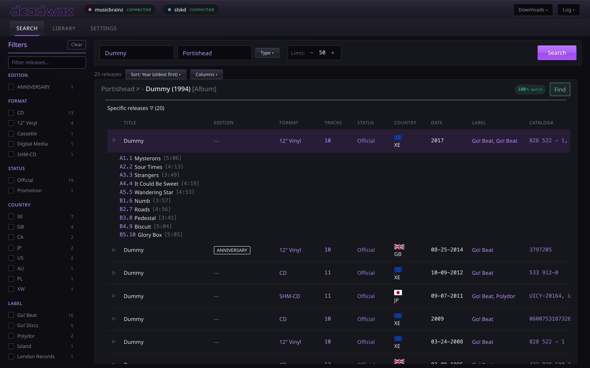
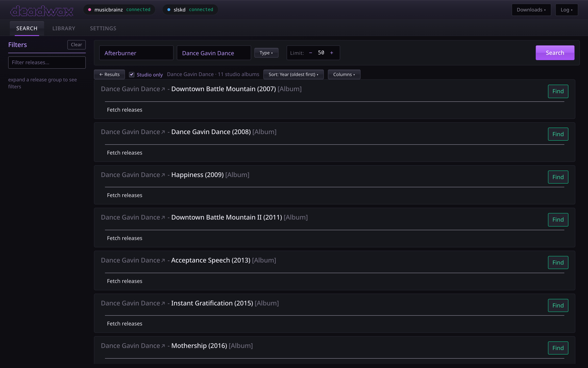
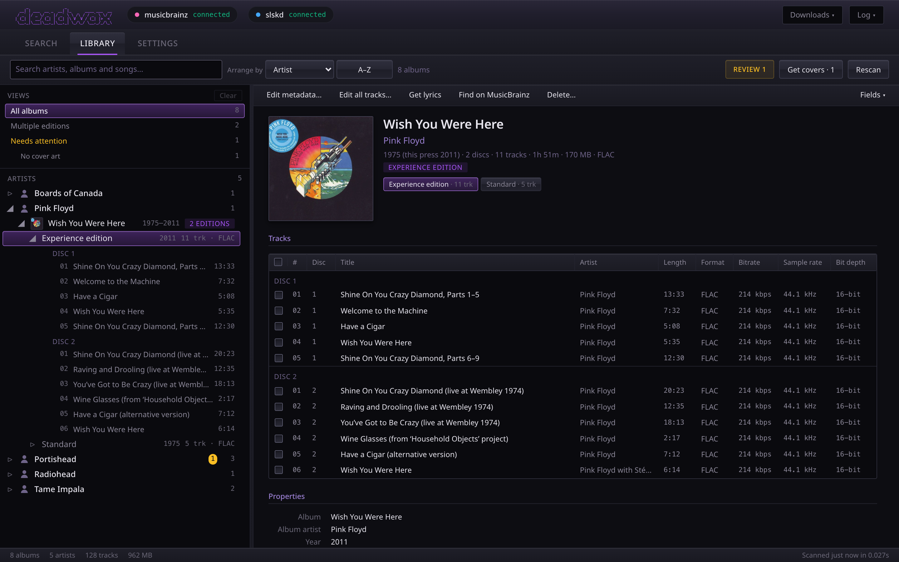
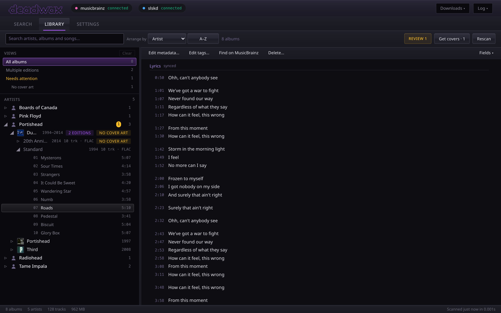
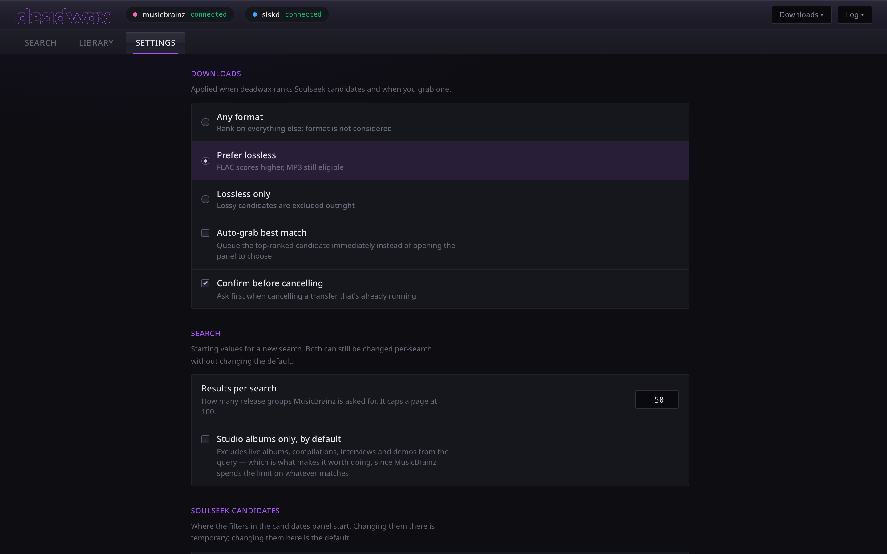
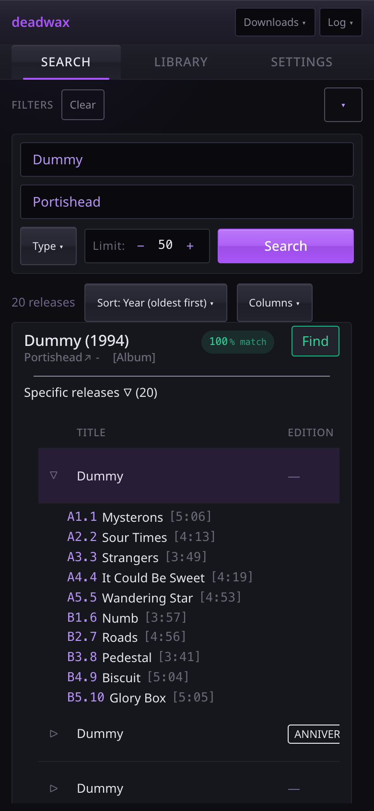

# deadwax

<p align="center">
  
</p>

<p align="center">
  <a href="https://github.com/real-lizardwizard/deadwax/releases"></a>
  <a href="https://github.com/real-lizardwizard/deadwax/pkgs/container/deadwax"></a>
</p>

*Formerly **jimbrainz**. Dead wax is the blank ring between a record's last groove and its label, where the matrix number that tells one pressing from another is scratched — which is the whole idea here.*

A one-page interface for finding music on MusicBrainz, pulling it down through slskd, and keeping the result tidy afterwards. Search is centred on specific **Releases** and **Release Groups** rather than artists — because most of the time you want one particular pressing of one album, not somebody's entire discography.

Pick the release you actually want, and deadwax searches Soulseek, ranks what comes back against that release's real tracklist, and shows you why each candidate scored what it did. One click queues it; when it finishes it gets tagged from the MusicBrainz data and filed into your library. Then the **library tab** shows you what you've actually got — including when you're holding three different pressings of the same record — and lets you correct anything that landed wrong.



<sub>Twenty pressings of *Dummy* — vinyl, CD, cassette, SHM-CD, across seven countries — with the tracklist of the one you picked. The filter column builds itself from whatever is on screen.</sub>

<!--
  These are captured from the running app against the live MusicBrainz API, at 2x. The one
  thing that is not real is slskd: nothing was downloading when they were taken, so the
  connection pill would otherwise read UNKNOWN_ERROR - which is a truthful report of the
  laptop and a completely misleading one about the app. A stub answered its status check so
  the pills show the ordinary working state. No screenshot claims a download happened.

  The library is a throwaway one: real FLAC files tagged and filed by deadwax's own code from
  real MusicBrainz releases, with covers from the Cover Art Archive - but the audio is quiet
  noise of the right length, which is why its bitrate reads low for FLAC.

  A moving demo would still be worth having for the search -> candidates -> download flow.
  ffmpeg, for a README-sized GIF out of a screen recording (2-4MB rather than 21):

      ffmpeg -i recording.mov -vf "fps=12,scale=1200:-1:flags=lanczos,split[a][b];\
      [a]palettegen[p];[b][p]paletteuse" -loop 0 assets/videos/demo.gif
-->

_Please note; this is a silly and fun container i made for my own server, its probably kinda shitty, the code is a mess, and theres certainly better alternatives out there. buuut if you like it thats awesome :)_<3

> **Heads up:** this is a fork of [LidBrainz](https://github.com/dual-shock/lidbrainz) that has diverged a long way. LidBrainz sends things to Lidarr; deadwax cut Lidarr out entirely and talks to slskd directly. If you want the Lidarr version, go use the original — it's good.

## Why not Lidarr?

Because of one specific thing that couldn't be fixed from the outside.

When you pick a *particular* release — the 2011 remaster, the deluxe edition — and hand it to Lidarr, all of that detail dies at the API boundary. Lidarr's search command only takes an album id, so the plugin doing the actual Soulseek search rebuilds a generic query from scratch and grabs whatever comes back. Tubifarry's own maintainer [confirms Custom Formats can't target the release variant you selected](https://github.com/TypNull/Tubifarry/discussions/138).

deadwax already knows everything about the release you clicked: its MBID, full tracklist with durations, edition tags, year, label. So it does the searching and the matching itself, and all of that context is actually used.

A caveat worth setting expectations on: this won't magically always find the exact remaster. Soulseek folder names are typed by strangers and frequently omit edition text entirely. What it does is *rank* candidates against your real tracklist and show its reasoning, so you can pick with actual information instead of hoping. Edition matching is a weighted signal, never a hard filter — filtering on it would hide perfectly good results.

## Installation

_Note: this runs on **OpenMediaVault**, with **[Komodo](https://komo.do)** managing Docker, so the compose file below is the path that gets used day to day — see [below](#installation-openmediavault--komodo). There's also an Unraid template [further down](#installation-unraid), inherited from the project this forked from._

### Prerequisites:
1. a running [slskd](https://slskd.org) instance reachable from this container, with an API key
2. an email address to give MusicBrainz as a contact (deadwax builds the rest of its user agent itself)
3. docker

### Environment:
1. either clone the repo: ```git clone https://github.com/real-lizardwizard/deadwax.git``` <br> or just grab the ```docker-compose.example.yml``` file
2. fill in the ```docker-compose.example.yml``` and rename it to just ```docker-compose.yml``` (here you can change the exposed port and docker network)
3. put your settings in **either** place — whichever you prefer:
   - the ```environment:``` block of your compose file, which keeps everything about the container in one file. This is usually what you want when something like Komodo, Portainer or Dockge manages your stacks.
   - or ```.env.example```, filled in and renamed to just ```.env```, which keeps your slskd API key out of a file you might paste into a forum post.

   Mixing them is fine: a setting in ```environment:``` wins over the same one in ```.env```, so you can keep the key in ```.env``` and the rest in compose. deadwax logs which source each setting came from when it starts, so you can check it picked up what you expected.

   MusicBrainz asks every app to identify itself with a way to contact whoever runs it, and rate limits the ones that don't ([their rules](https://MusicBrainz.org/doc/MusicBrainz_API/Rate_Limiting)). Set `MUSICBRAINZ_EMAIL` to your email address and deadwax does the rest: it sends `deadwax/<version> ( you@example.com )` with the version it's actually running filled in, so there's nothing to keep up to date when you upgrade. It can be set from the settings tab too. If you wrote a `MUSICBRAINZ_USERAGENT` by hand before this existed, it keeps working — its contact is lifted out and used — and the settings tab says so.

**`SLSKD_URL` has to be reachable from inside this container**, which is not always the address you type into your browser. If slskd is another container on the same docker network, use its service name and internal port — `http://slskd:5030` — rather than your host's IP and published port. It needs the scheme (`http://`) either way; deadwax says so specifically if it's missing.

**The one that trips everyone up:** `SLSKD_DOWNLOAD_PATH` has to point at the *same files* slskd writes its finished downloads to, as seen from inside this container. If the two containers disagree about that path, organizing quietly finds nothing. It's the most likely first-run problem by a mile.

`LIBRARY_PATH` is where organized music goes, and it's also what the library tab reads. If you don't set it, everything else still works — the library tab just tells you it isn't configured.

### Upgrading from jimbrainz

It's the same app under a new name, and 0.7.0 is the first release under it. Point your compose file or Komodo stack at **`ghcr.io/real-lizardwizard/deadwax`** instead of `…/jimbrainz` — nothing redirects the old image name, and it stops getting updates at 0.6.20. Nothing else needs changing:

- **Your database is found where it is.** A `DB_PATH=/config/jimbrainz.db` line keeps working as it is, and if you never set `DB_PATH`, the old `/config/jimbrainz.db` keeps being used until a `deadwax.db` exists. Don't rename the file by hand to "match" — leave it.
- **Your browser keeps its layouts and preferences** — column widths, panel sizes, the library's fields and sort. They're carried over to the new name the first time the page loads.
- If you had the page open during the upgrade, reload it.

### Which image tag?

| tag | what it is |
| --- | --- |
| `:latest` | **the current release** — slskd direct, no Lidarr. 0.7.x, and what the settings above describe. |
| `:0.7.0` etc | pinned releases of that same line (0.6.20 and older are under the old `jimbrainz` image name) |
| `:experimental` | the `experimental/*` branch, rebuilt on every push. Ahead of `:latest`, and moves under you. |
| `:0.2.1` and older | the original Lidarr-based line, still on `main`. Does **not** understand the settings above. |

> **If you were already pulling `:latest` from before 0.3.0, read this.** Up to 0.2.1 that tag was the Lidarr-based version. From **0.3.0 onward it is this slskd-direct rewrite**, which has no Lidarr support at all and takes different settings. Pulling `:latest` will replace one with the other. Pin **`:0.2.1`** if you want the Lidarr version to keep working.

The example compose file on this branch points at `:experimental`. It moves whenever the branch does, so use `:latest` or pin a version if you want it to hold still.

### Running
run docker compose from the same folder as your cloned repo / docker-compose file:<br><br>&nbsp;&nbsp;&nbsp;&nbsp;&nbsp;&nbsp;`docker-compose up -d`<br><br>this by default starts the container on localhost:8080, or whatever port you configured it to.

Organizing starts in **`dry_run`** mode on purpose — it logs what it *would* do and touches nothing. Watch the event log, confirm it's finding your files and building sane paths, then switch `ORGANIZE_MODE` to `copy` or `move`.

## Features (and sorta how they work)

### Release centered querying
<details>
<summary style="font-style:italic">Everything is a release group, not an artist</summary>
Most tools use Artist objects as the "main" form of adding and storing data, i didnt like this as 99% of the time i dont want ALL the releases of an artist, i usually just want 1-2 albums. deadwax searches release groups, then lets you drill into the exact pressing you want.
</details>

### Ranked Soulseek candidates
<details>
<summary style="font-style:italic">Scored against the release you actually picked, with the reasoning shown</summary>
Each peer's files get grouped into (user, folder) candidates and scored on track count, fuzzy title match against the real tracklist, track durations, format/bitrate, peer health, and edition/year. You see a score breakdown per candidate so it's obvious <em>why</em> one ranked above another — and can filter by free slot, complete albums only, format, or minimum score.
<br><br>
The speed on a candidate reads <code>peer avg</code> because that is what Soulseek reports: the peer's average upload rate across their whole history, to everyone. It is split between everyone they're serving at once and averaged over conditions that have since changed, so it is not a prediction of your transfer and routinely reads high. The free-slot and queue figures beside it are the better guide. deadwax weights it accordingly — peer health is the lowest of the six signals, an availability tiebreaker rather than a ranking criterion.
<br><br>
It searches under every name the artist has put records out under, because Soulseek needs every word of a search somewhere in a share's path — so a search for "Ye BULLY" can never find a share filed under <code>Kanye West/</code>. It tries the name on the release, the name the artist goes by now, and any name MusicBrainz marks as one they've stopped using, all at once rather than one after another. For an artist who never renamed, which is nearly everyone, that's one search as before, and it never waits on MusicBrainz to start. The query box shows the first name; hover it to see the others, and editing it searches exactly what you typed.
<br><br>
Once you've actually downloaded from someone, the row leads with <code>you got 780 KB/s</code> instead — what deadwax measured itself while bytes were moving, with queue time excluded. Nothing in the Soulseek protocol will tell you a transfer's speed before it starts, so this is the closest thing to an answer there is, and it's the one number on the row that was measured rather than claimed. It builds up as you use it: peers you've never downloaded from simply don't have it.
</details>

### An artist's discography, in order
<details>
<summary style="font-style:italic">Which a search genuinely cannot give you</summary>
Click an artist's name in any result and you get everything they've released, oldest first. Portishead: three studio albums. Dance Gavin Dance: eleven, 2007 to 2025.
<br><br>
This is a <em>browse</em>, not a search, and the distinction is the whole point. MusicBrainz answers a search in relevance order and spends the limit on whatever matched — so sorting fifty search results by year gives you the oldest of the fifty most <em>relevant</em>, which for most artists is bootlegs with the actual albums scattered among them. Asking for everything credited to one artist is the only way "oldest first" means what it says.
<br><br>
Live albums and compilations are filtered out by default and one toggle away. Very prolific credits (Various Artists and the like) are capped, and it says so rather than pretending the list is complete.
<br><br>



</details>

### Sorting the results
<details>
<summary style="font-style:italic">Chronological by default</summary>
Year (either direction), best match, title or artist. It reorders what's on screen without asking MusicBrainz again.
<br><br>
Worth knowing what it can't do: sorting search results by year sorts <em>the results you got</em>, not the whole catalogue. That's what the discography above is for.
</details>

### Browsing releases like it's MusicBrainz itself
<details>
<summary style="font-style:italic">A proper data grid for digging through every pressing of an album</summary>
Releases show as a table with label, catalog number, barcode, quality, language/script and disambiguation on top of format/tracks/status/country/date. Columns reorder, resize and hide. The filter column derives its checkboxes from whatever is actually on screen, and each one is tri-state — click once to require it, again to exclude it, so "any pressing except the deluxe edition" is one click.
</details>

### Downloads that remember what they're for
<details>
<summary style="font-style:italic">slskd only knows "bob is sending you 12 files"</summary>
deadwax keeps the link between a download and the MusicBrainz release that started it, in a small sqlite database. That's what makes tagging possible later, and it's why the downloads panel can tell you what an in-flight transfer actually is — with live progress, queue position, and a real transfer rate worked out from byte deltas rather than slskd's cumulative average, which only ever creeps upward.
<br><br>
Cancelling and clearing respond on the click rather than after the round-trip to slskd and back, so the buttons feel connected to something. The prediction is dropped the moment the server disagrees, and abandoned entirely if it never answers.
</details>

### Tagging and filing, with editions kept apart
<details>
<summary style="font-style:italic">Two pressings of one album no longer collide</summary>
Files land as <code>{artist}/{album} ({year}) [{edition}]/{NN} - {title}.{ext}</code>, tagged from the MusicBrainz release — including MusicBrainz IDs, so the library stays readable by Picard and beets instead of being a deadwax-only artifact. Track numbers and titles come from the matched tracklist, so they're right even when the peer named everything "Track 04.mp3". It never overwrites an existing file. In move mode the slskd folder it came from is cleared away afterwards, leftover junk and all — the art and sidecars worth keeping have already moved into the library by then — unless music is still sitting in it, which means something in there was never filed and the folder stays. Re-filing an album that empties its old artist folder takes that folder with it too.
<br><br>
The edition suffix is omitted for ordinary albums, and only appears when there's something to say. That includes <em>alternate performances</em> — an instrumental or acoustic version has the same track titles and numbers as the album it accompanies, so without a marker it would land in that album's folder, every file would be skipped as already-present, and the import would tell you there was nothing to do. The name comes from MusicBrainz's own disambiguation where it has one, then detected edition tags, then format or country — and two genuinely different releases that would still collide get separated by catalogue number.
<br><br>
The year is the <em>album's</em> year, not the pressing's, so a 2011 remaster of a 1975 record files under <code>Wish You Were Here (1975) [Remastered]</code> rather than landing in a different decade from the original. The file still records which pressing it actually is.
<br><br>
The artist folder is the artist's <em>current</em> name, so one artist is one folder however many names their records came out under. Ye's albums are credited "Kanye West" up to 2024 and "Ye" after; they all file under <code>Ye/</code>, with the <code>albumartist</code> tag to match, so players that group on that tag show one artist too. The credit isn't thrown away — each track's <code>artist</code> tag still says what the sleeve says, and the Soulseek search still asks for "Kanye West", because that's what people named their folders. Albums you already have under an old name move when you pick their release in the metadata editor; nothing goes looking for them on its own yet.
</details>

### A library tab that knows what you've got
<details>
<summary style="font-style:italic">Laid out like a file explorer, including when you're holding three versions of the same record</summary>
Reads your library off disk with mutagen and shows it as a tree, the way Windows Explorer shows folders: artists at the top, their albums indented underneath when you open one, then the songs. Whatever you pick shows up in a pane on the right with its cover, its properties, what's wrong with it, and every track. The arrow keys walk the tree like Explorer's do, and you can drag the divider between the two panes.
<br><br>
Albums you hold more than one version of say so on their own row ("3 editions"), which was the entire point, and open to one row per edition. Identity comes from tags rather than folder names, so renaming a folder by hand doesn't split an album in two. Folders with no MusicBrainz id at all — i.e. anything that predates deadwax — are left as their own albums rather than being guessed at and merged.
<br><br>
The search box matches song titles as well as artists and albums: type a song and the tree opens its album to show you where it is.
<br><br>
You can arrange it by artist, album, release date or date added, either way round. By artist it's the tree above; the other three list albums directly under headings (a letter, a year, a month), like Windows 7's music library did. "Date added" goes by when deadwax first saw an album, or its folder's date if that's earlier, so a library that was there before deadwax still sorts sensibly.
<br><br>
The track list shows <em>whichever fields you want</em>. A Fields menu (or right-clicking the column headers) switches columns on and off: track and disc number, artist, genre, composer, label, catalogue number, ISRC, bitrate, sample rate, bit depth, channels, the MusicBrainz ids, and more. Drag a column's header sideways to move it, and its right-hand edge to size it, the way Explorer does — the edge stays under the cursor, and the columns to its left hold still rather than shuffling about under your hand; double-click that edge to give the column back its own width. The order and the widths are remembered along with which fields you picked, and Reset in the Fields menu puts all three back. Pick a single track and those same fields list down the pane, with every other tag the file carries underneath. Track details are read from the files when you look at them, so they show what's on disk now even if something other than deadwax changed the tags.
<br><br>
Multi-disc sets run disc by disc under "Disc 1", "Disc 2" headings, rather than dealing the two discs out alternately because both start at track 1. A track with no disc number reads as disc 1 — that's where it sorts, and how every player treats it — and the column says so in a dimmer grey, so it can't be mistaken for a disc number the file actually carries.
<br><br>
Opening the tab is instant after the first time. The last scan is saved in deadwax's database, so the library draws straight away from that, says how old it is, and checks the disk for changes underneath while you browse. That includes after a restart, which used to mean re-reading every tag in the library. Retags and deletes made in deadwax update the saved copy as they happen, and an album deadwax files from a download turns up on its own a second or two after it lands — no Rescan, whichever tab you're on. If you change files with another program, use Rescan.
<br><br>
Cover art comes from a file beside the tracks, then from art embedded in the audio, then from the Cover Art Archive. Click a cover to see it full size; click again to zoom in on the spot you clicked, scroll to zoom by degrees, and drag to move around it.
<br><br>



</details>

### Artist pages, with pictures

Click an artist in the library and you get a page about them rather than a heading: who they are, where they're from, how long they've been going, what MusicBrainz tags them as, the current line-up with instruments (and how many members came before), their official site and socials named after where they actually go, and their albums oldest first.

Above all that: their own pictures. **MusicBrainz has none** — the Cover Art Archive is for releases, and what musicbrainz.org shows on an artist page is a Wikimedia Commons photo reached through Wikidata. deadwax uses that too, and adds <strong>fanart.tv</strong> and <strong>TheAudioDB</strong> if you give either a key in the settings tab — between them they have the banners, logos, backgrounds and wide shots an artist page is actually made of. fanart.tv's artwork is voted on by the people using it, so deadwax offers the most-liked of each kind first; its key is issued per application rather than per person, so you register your own at fanart.tv.

They're written into the artist's folder, so <em>other things read them too</em>:

| what | file | who reads it |
| --- | --- | --- |
| square image | `artist.jpg` | **Navidrome, with no configuration at all** — its `ArtistArtPriority` already looks for `artist.*`. Kodi and Jellyfin too |
| banner | `banner.jpg` | Kodi, Jellyfin |
| logo | `logo.png` | Jellyfin; Kodi reads it as clearlogo |
| background | `fanart.jpg` | Kodi's fanart, and one of Jellyfin's backdrop names — one file serves both |
| wide image | `landscape.jpg` | Kodi's landscape, Jellyfin's thumb |
| clear art | `clearart.png` | Kodi |

Finding the right artist copes with them having **renamed**, which is commoner than it sounds. MusicBrainz keeps one current name per artist and every previous one as an alias, while each release keeps the name it was *credited* under — so Ye's albums are credited Kanye West, your folder is called Kanye West, and MusicBrainz's artist is called Ye. deadwax searches aliases as well as current names, and compares them ignoring how a name happened to be typed, so `Motorhead` finds Motörhead and a plain hyphen finds JAŸ‐Z. The page says "Now: Ye" when MusicBrainz calls them something other than your folder does — which, since new albums file under the current name, mostly means albums that arrived before. Two artists genuinely sharing a name are still refused rather than guessed at — that's what the picker is for.

A picker shows every candidate each source offered — TheAudioDB usually has four backgrounds — so you choose which one belongs at the top of the page rather than taking whatever sorted first. You can search MusicBrainz from inside it for the right artist, which is how you get past files with no MusicBrainz ids and the several bands that share a name, and any picture it found can be used in any slot — so a single photo can be both the square image and the background. Pictures already in the folder are left alone unless you tick "replace". Nothing is written into a folder that holds tracks: that's an album, and those filenames mean something else there.

Without a key you still get a photo where Commons has one, and the rest of the page is unaffected.

### Lyrics
<details>
<summary style="font-style:italic">Synced where they exist, saved where your player looks</summary>
Lyrics come from <a href="https://lrclib.net">LRCLIB</a> — free, no key, and the one source with <em>time-synced</em> lyrics for a large part of what people actually listen to. Each track's are saved as a <code>.lrc</code> file with the track's own name, right beside it: <code>07 - Roads.flac</code> gets <code>07 - Roads.lrc</code>. Navidrome reads those with no configuration at all (<code>.lrc</code> is in its default <code>LyricsPriority</code>), and Jellyfin and Kodi read them too. The audio files themselves aren't touched.
<br><br>
They're fetched three ways. <strong>As an album is filed</strong> from a download, in the background so it never holds anything up — <code>FETCH_LYRICS=off</code>, or the settings tab, turns that off. <strong>Get lyrics</strong> in an album's command bar fetches whatever tracks are still without. And <strong>Get lyrics · N</strong> in the library toolbar runs over every album in view that has none at all, one album at a time, stoppable, like Get covers.
<br><br>
Pick a track and its lyrics are under its properties, with the time beside each line when they're synced. Lyrics some other tagger embedded in the file show there too.
<br><br>
<strong>If lines land a beat late</strong> in your player — the line just sung still lit up on a fast song — that's LRCLIB's timings: they're tapped along by people and tend to trail the singing by a fraction of a second. <code>LYRICS_LEAD_MS</code> in the settings tab moves every line earlier by that many milliseconds as it's written (300 is a good start), and <strong>Re-time saved lyrics</strong> beside it moves the ones already on disk. It changes the timestamps themselves rather than adding an offset tag, because some players (Amperfy among them) read that tag and ignore it. Re-timing only touches files that are still exactly LRCLIB's lyrics — one you corrected by hand, or got from somewhere else, is left as it is — so it's safe to run again, or after changing the lead.
<br><br>
It's matched on the track's title, artist, album and <em>length</em>, and the length is what keeps it honest: a result more than two seconds out is a different recording — a live take, an edit — and its timings would be wrong. One only a little out, like a vinyl pressing that runs a few seconds longer than the CD, gives you its <em>words</em> without its timings. A <code>.lrc</code> already there is never replaced. What happened to each track is reported and kept apart: saved, not on LRCLIB, instrumental (nothing is written — an invented "instrumental" line would be a lyric nobody sang), or failed, which is worth trying again. LRCLIB gets busy under a long run and says so; deadwax waits and asks again before calling it a failure.
<br><br>



</details>

### Fixing things that landed wrong
<details>
<summary style="font-style:italic">Pick the release an album really is, and write it back</summary>
Picard-shaped, but small. Open the editor on any album and it searches MusicBrainz straight away; the release your files are already tagged with sorts first and is marked <code>current</code>, so you can see what it currently matches instead of hunting for it.
<br><br>
Pick a release and it fills in the fields, or type them yourself — artist, album, year, original year, and the edition name that names the folder. So if MusicBrainz says "remixed by john" and you'd rather the folder just said <code>[REMIX]</code>, type that.
<br><br>
Nothing is written until you press apply, and the preview showing what would change is produced by the same code that does the writing — so it can't drift into lying about it. It can also pull the release's cover into the folder, with the incoming art shown next to the one you already have. Click either cover to compare the two <em>at full size</em>, side by side, with their real pixel dimensions and the larger one marked. Each zooms and moves on its own, so you can go and look at the same corner of both. Two sleeves that look identical as thumbnails usually differ in exactly that, and you can keep the new one from right there.
<br><br>
Multi-disc releases are tagged per disc, the way MusicBrainz and every player number them: disc 2 starts at track 1 of disc 2 rather than carrying on from disc 1. Single-disc albums aren't given a disc number at all, so an album that's already right still reads "nothing to change" — but a track claiming to be on some <em>other</em> disc is put back on disc 1, so re-applying the right release fixes a stray disc number instead of leaving it where it was.
<br><br>
Covers are saved at 500 × 500 unless you choose otherwise: <strong>Cover art</strong> in the settings tab offers 250, 500, 1200 or <em>full size</em>, which is the original upload — often thousands of pixels and several megabytes. It applies to "Get cover", the bulk fetch and the editor alike, and the editor says which size it will save.
</details>

Tags now record **who** as well as what: `musicbrainz_albumartistid` and `musicbrainz_artistid` go in alongside the release ids, so a library deadwax filed says which artist it means rather than leaving the name to be matched later. A track credited to somebody else — a split, a compilation, a guest spot — keeps its own artist instead of being given the album's, and credits read the way MusicBrainz writes them: "A / B", "A & B", "A feat. B", rather than everything flattened to a comma.

### Editing tags by hand
<details>
<summary style="font-style:italic">One track, or a whole selection at once</summary>
For everything a release can't fix — a genre MusicBrainz doesn't carry, a composer credit, the one track that ended up on the wrong disc. Tick tracks in an album's list (Ctrl/Cmd-click and Shift-click tick too, and Space ticks the row you're on), then <strong>Edit N tracks…</strong> in the command bar. With nothing ticked it edits every track in the album, and on a single track's page it edits just that one.
<br><br>
It covers title, artist, album, album artist, track and disc number, year, original year, genre and composer. A field where the tracks disagree says so and starts empty, and <em>left alone it keeps each track's own value</em> — only the fields you actually change are written. Empty a field to remove that tag. The preview beside the fields lists every change, file by file, before anything is written, and it comes from the same code that does the writing. If any part of an edit is invalid, the whole thing is refused rather than half-applied.
<br><br>
It's tags only: no file is renamed and the folder stays where it is. The metadata editor is still what re-files an album once its tags say it belongs somewhere else.
</details>

### Deleting albums
<details>
<summary style="font-style:italic">With a confirmation that actually tells you what's about to go</summary>
Delete is in the command bar above any album (or any one edition of it). The confirmation names the folder, the track count, the size, and any files in there that are neither audio nor artwork — a rip log or a cue sheet might be the only copy, so those get listed individually.
<br><br>
It's permanent, there's no undo, and it says so. It refuses anything that isn't an album inside your library, including artist folders, so it can't take a whole discography by accident.
</details>

### A settings tab that tells you why something isn't working
<details>
<summary style="font-style:italic">Your preferences, and a straight answer about the container's configuration</summary>
Two halves, deliberately kept apart. The top is <em>yours</em> - format preference, auto-grab, how a new search starts, where the Soulseek candidate filters begin - stored in your browser and saved as you change them.
<br><br>
The bottom is the container's configuration, and most of it is <strong>editable</strong>. Changing a setting stores an override in deadwax's own database and applies it <em>without a restart</em> — it does not write to your <code>.env</code>, because editing that from inside the container wouldn't affect the running process anyway. An override wins over the environment (the alternative would mean your edit silently reverting on the next restart), the row says so, and one click reverts it. Two settings can't be changed here and say why: <code>DB_PATH</code> is the database the overrides live in, and <code>PUID</code>/<code>PGID</code> are applied before Python even starts.
<br><br>
It still reports, which is half the point. For every setting: the value this container <em>actually received</em>, <strong>which file supplied it</strong> (your compose <code>environment:</code> block or <code>.env</code> — indistinguishable from the value alone, and always the first question when something's wrong), and what is broken about it if anything.
<br><br>
It resolves the paths rather than trusting them, which is the point. <code>SLSKD_DOWNLOAD_PATH</code> pointing at a path that exists on the <em>host</em> but not inside the container is the most common first-run failure by a wide margin, and it is invisible from the value — the string looks perfectly correct. It also answers "why did nothing get filed" once, in a sentence, with every reason listed, rather than leaving you to infer it from four separate rows. The API key is never sent to the browser at all.
<br><br>



</details>

### Panels that behave like windows
<details>
<summary style="font-style:italic">Grab any edge, drag the title bar, and it remembers</summary>
The candidates and metadata dialogs resize from any edge or corner rather than from a single grip in one corner, and they move by their title bar the way a window does. The edge you grab stays under the cursor — the CSS `resize` property drags in the element's own untransformed space, so on the centred dialogs the corner used to run away at double speed the further you pulled.

The Downloads and Log dropdowns stay anchored under the button that opened them. They resize from their free edges — the left, the bottom, and the corner between — so they grow away from the button, but they don't move: a dropdown you could drag across the screen like a tab stopped being attached to anything.

Size is remembered per panel, so a log you widened once stays that width, and the two dialogs remember where you put them too. A remembered spot that no longer fits — because the browser window is smaller today — comes back clamped to the edge with a strip of the title bar still on screen, rather than somewhere you can never reach it again. Resizing wins over moving where the two overlap at a title bar's own edges, and the controls inside a title bar still just click.
</details>

### It works on a phone now
<details>
<summary style="font-style:italic">It really, really did not before</summary>
On a 375px screen the original layout laid out 1131px wide, with the entire top bar of buttons simply off the right-hand edge. That got fixed first; then it got made usable, which is a different job.

The header is one row rather than four — the wordmark is set as text on a phone instead of drawn as ASCII art, and the connection pills only appear when something is actually wrong. The search form puts its three small controls on one row. Result cards lead with the album title and fit five to a screen instead of one and a half. The columns stack, the filter list collapses behind a toggle, and the dropdowns become bottom sheets.

Measured at 375px: the header went from 161px to 47px, the search form from 450px to 146px, and a result card from 280px to 99px.
<br><br>



</details>

## (more importantly) Non-features (and how they dont work)

Being lightweight and fast (and working _just enough_) was and is the only focus, so authentication (as in a login page), recommendations, and batch adding artist discographies are not present.

### Adding whole artist discographies at a time
<details>
<summary style="font-style:italic">deadwax only uses release groups, not artists</summary>
Theres no native feature to add entire discographies quickly (unless you type really fast). There are much better alternatives for that out there.
</details>

### Metadata from anywhere but MusicBrainz
<details>
<summary style="font-style:italic">Tags come from MusicBrainz, and only from MusicBrainz</summary>
Everything deadwax writes into a file's tags comes from MusicBrainz, so if a release isn't there it can't tag it — you can still edit tags by hand. The pictures and lyrics are the exceptions, and they go in files beside the music rather than in the tags: covers from the Cover Art Archive, artist images from Wikimedia Commons (plus fanart.tv and TheAudioDB if you give them a key), and lyrics from LRCLIB.
</details>

### Recommendations
<details>
<summary style="font-style:italic">deadwax can only be used for searching stuff and downloading it</summary>
Theres no tracking of what you download or listen to, so theres nothing to base cool recommendations on.
</details>

### Any kind of login
<details>
<summary style="font-style:italic">Anyone who can reach it can use it</summary>
There is no authentication of any kind. It can delete files and rewrite tags, so put it behind whatever you already use for the rest of your homelab, and dont expose it to the internet.
</details>

### Undo
<details>
<summary style="font-style:italic">Nothing here can be taken back</summary>
Retagging and editing tags rewrite them in place, and deleting removes files for good. The previews before a retag or a tag edit and the confirmation before a delete are the whole safety net, which is why all of them try hard to tell you exactly what's about to happen.
</details>

## Installation (OpenMediaVault + Komodo)

This is how deadwax actually runs: OpenMediaVault for the box, Komodo managing Docker.

Komodo deploys compose stacks, so there's nothing deadwax-specific to learn — point a stack at this repo, or paste `docker-compose.example.yml` into one, and put the settings in the stack's environment (or in a `.env` beside it; which wins is described above).

Four things are worth getting right the first time:

1. **`PUID`/`PGID` should match whoever owns the media on your OMV share**, and should be the same pair slskd runs as. If the two disagree, deadwax files albums away as a user slskd can't write — or the other way round. OMV's shared folders commonly sit in the `users` group.
2. **`SLSKD_URL` has to be reachable from inside this container.** If slskd is another stack on the same host, put both on one docker network and use its service name and internal port (`http://slskd:5030`) rather than the host address you type into your browser.
3. **`SLSKD_DOWNLOAD_PATH` and the `/downloads` mount have to point at the same files slskd writes**, as this container sees them. It's the most likely first-run problem by a mile, and it fails quietly: organizing simply finds nothing.
4. **Mount your library** where `LIBRARY_PATH` points, or the library tab has nothing to read.

Leave `ORGANIZE_MODE` on `dry_run` until the event log shows it finding your files, then switch it to `copy` or `move`.

## Installation (Unraid)

**Inherited from [LidBrainz](https://github.com/dual-shock/lidbrainz), which this forked from, and untested since.** Its author ran Unraid and wrote this template and these notes; deadwax is developed and run against OpenMediaVault, so nobody here has put it in front of an Unraid box in a long while. The variables it sets are kept current with the app — the Unraid mechanics around them are upstream's, and it has never been published to the Community Applications plugin. Images are built and published to ghcr.io automatically on tagged releases either way.

### how to manually add the template
1. move/copy `my-deadwax.xml` to `/boot/config/plugins/dockerMan/templates-user/`
2. in the docker tab on Unraid, click "add container"
3. the deadwax template should show up in the template dropdown, select it

### how to set up the container
1. pick a webui port thats not in use by any of your other containers
2. to access slskd through its hostname, select the same docker network as your slskd instance
3. fill in the required fields, see the .env.example configuration if youre unsure what to put there
4. point the `/downloads` mapping at the same folder slskd writes finished downloads to
5. point the `/music` mapping at your library if you want the library tab to do anything

it should now run just like any other Unraid docker container, and you can automatically pull eventual updates through the docker tab.

## who is this for?

Most of the music i listen to is on MusicBrainz, so this app uses MusicBrainz to find things and slskd to fetch them.

i didnt like using the MusicBrainz website as a search engine and then switching tabs to kick off a download, so i put it all into one ui. and i got tired of asking for a specific remaster and getting whatever turned up. if you feel the same, this could be for you.

## who is this NOT for
basically anyone who wants more functionality than whats mentioned above. if you want a full library manager with its own metadata pipeline, use Lidarr — genuinely.

## probable issues
- **Organizing finds nothing:** almost always `SLSKD_DOWNLOAD_PATH` not pointing at the same files slskd writes. deadwax says so explicitly when this happens rather than pretending it worked.
- **A download says it finished but the album isnt there:** if a folder with that name already existed, every file is skipped rather than overwritten, and the job now says so instead of reporting success. Usually means you already have that edition.
- **Rate limiting:** MusicBrainz rate limits requests that don't carry a contact, so check `MUSICBRAINZ_EMAIL` is set — the settings tab shows the exact user agent being sent. deadwax also has a built-in rate limiter, so if you're getting rate limited more than you'd expect it's likely the contact.
- **A search fails and says slskd isn't connected to Soulseek:** slskd's web API answers whether or not slskd has logged in to the Soulseek network, so deadwax can reach it perfectly while no search can possibly run. The connection pill reports that connection rather than just the API, and a failed search names which of the two is wrong — including when slskd is waiting on a VPN container to come up, which is the usual cause when slskd runs behind one. It answers `409 Conflict` in that state, which is not what the word suggests.
- **A search returns nothing:** Soulseek search is a substring match over filenames people happened to type. Try the editable query box in the candidates panel — trimming it down often helps more than adding detail.
- **MusicBrainz is just down sometimes:** it happens a lot. deadwax tells you thats what happened rather than showing you an empty result and letting you blame your search terms.
- **The library tab is empty:** check `LIBRARY_PATH` is set and points at the same music the container can see. It says which of those is wrong.
- the ui has many problems, i just wanted it to look pretty cause i like pretty things
