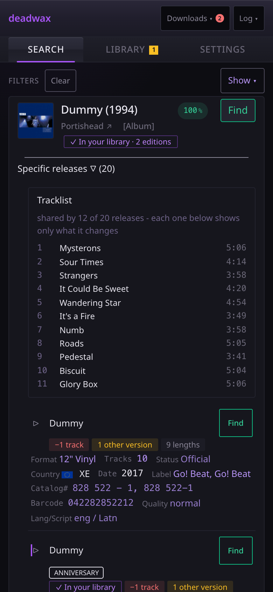
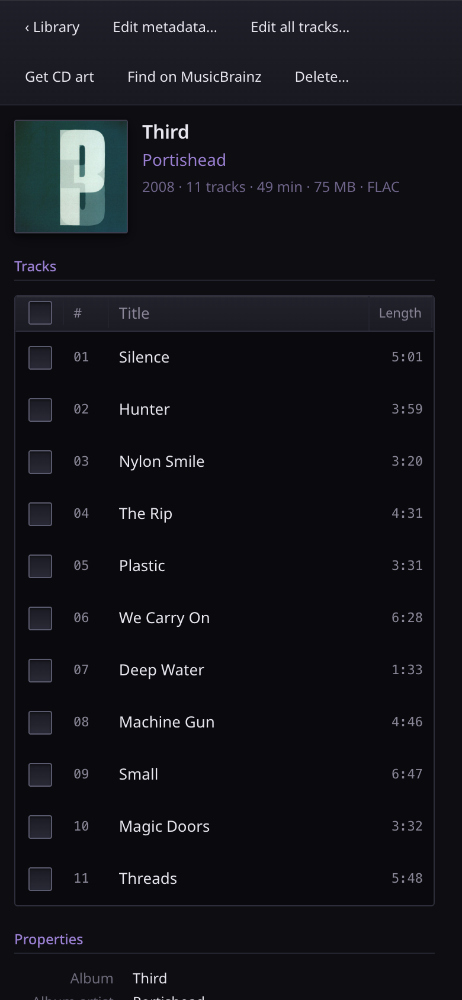

# The deadwax guide

Everything deadwax does, explained for someone opening it for the first time. The
[project README](../README.md) is the tour; this is the manual.

## Start here

1. **[Getting started](getting-started.md)**: what you need, the compose file, and the first run,
   step by step, including the one path that trips everyone up.
2. **[Configuration](configuration.md)**: every setting, what it does, its default, and where to
   change it.

## Using it

| page | covers |
| --- | --- |
| [Finding music](finding-music.md) | searching MusicBrainz, the type filter, sorting, an artist's discography, release lists and the filter column, and "in your library" marks |
| [Downloading](downloading.md) | the Soulseek candidates panel, what the scores mean, quality filters, the downloads panel, cancelling, and retrying a failed download |
| [Organizing](organizing.md) | what happens when a download finishes: dry run, copy or move, folder names and templates, editions, tags, covers, lyrics, and clean-up |
| [The library](library.md) | the library tab, the review queue, the metadata editor, editing tags by hand, covers, CD art, lyrics, artist pages, deleting |
| [The phone player](player.md) | playing your library on an iPhone from Navidrome, through deadwax: setting it up, adding it to the home screen, how plays are counted, and what it can't do yet |
| [How matching works](matching.md) | the six signals a candidate is scored on, and why edition is never a filter |
| [Troubleshooting](troubleshooting.md) | what to do when something doesn't work, by symptom |

## The ideas it's built on

A few words mean something specific here, and the rest of the guide leans on them.

- **Release group**: an album as an idea. *Dummy* by Portishead is one release group, whatever
  format or country or year you hold it in. Search results are release groups.
- **Release**: one specific pressing of it. The 1994 UK CD, the 2014 20th-anniversary vinyl, the
  Japanese SHM-CD. MusicBrainz lists them all, and each has its own tracklist, catalogue number
  and id. This is the level deadwax works at: you pick the pressing you actually want.
- **Edition**: what tells one pressing of an album apart from another in *your* library: "2011
  remaster", "Deluxe edition", "Instrumental". It goes in the folder name, so two editions of
  one album sit side by side instead of overwriting each other.
- **Candidate**: one folder on one Soulseek user's share that might be the release you picked.
  A search usually finds several; deadwax scores each against the release's real tracklist.
- **Peer**: the Soulseek user sharing a candidate.
- **Job**: one download as deadwax remembers it. It keeps the release it's for, which is what
  lets a finished download be tagged and filed even if MusicBrainz is down at the time.
- **Dry run**: organizing that only *reports* what it would do. It's the default, because
  organizing is the one thing that writes to your music library.

## The flow, end to end

1. Search MusicBrainz for an album, and pick the exact pressing you want.
2. **Find** searches Soulseek through slskd, under every name the artist has gone by, and ranks
   what comes back against that pressing's tracklist.
3. **Download** queues the folder you choose in slskd. The downloads panel follows it.
4. When it finishes, the files are tagged from MusicBrainz and filed into your library (or, in
   dry run, the log says where they would have gone), and lyrics are fetched for each track.
5. The library tab shows what you have, flags what's wrong with it (a missing cover, say), and
   lets you fix it.

## On a phone

Everything works on a phone. The search view scrolls as one page, release lists become one
block per pressing, the candidates panel is a full-screen sheet, and the library's details open
as a sheet over the tree. A few gestures are phone-specific:

- Tap an artist to open it in the library; **tap it again** to see the artist's page.
- **Pinch** to zoom a cover in the cover viewer, and drag to move around it.
- The filter lists on the search and library views are collapsed behind a **Show** button to
  keep them out of the way.

For listening, there's also [the phone player](player.md) at `/player/`: a separate page that
plays your library from Navidrome, made to be added to an iPhone's home screen. It has tabs of its
own (Home, Library, Search, Requests and You), and is growing into the one app for all of deadwax.

&nbsp;&nbsp;

## For developers

[CLAUDE.md](../CLAUDE.md) is the working notes: every design decision, and why. The
[frontend migration plan](FRONTEND-MIGRATION.md) covers the move from the original vanilla
JavaScript to Preact.
