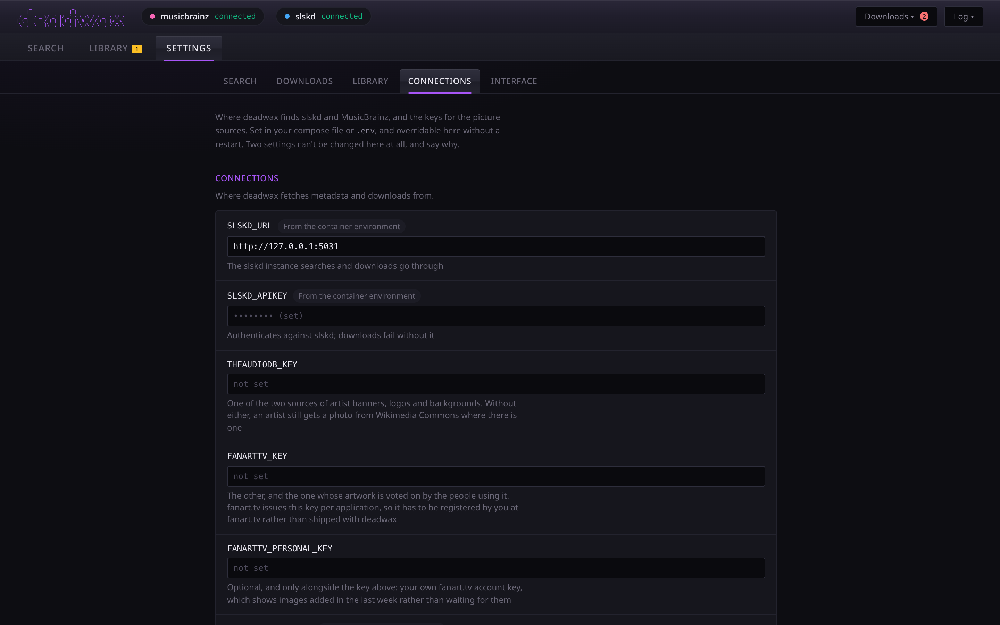

# Configuration

There are two kinds of setting. **Server settings** belong to the container: where slskd is,
where your library is, how albums are filed. **Preferences** belong to your browser: how many
search results to ask for, which candidate filters start switched on. Both are edited in the
**Settings** tab, which has five pages: Search, Downloads, Library, Connections and Interface.

## Where a server setting comes from

A server setting can be given in three places. The first one found wins:

1. **The settings tab.** A value saved there is stored in deadwax's database and applies
   immediately, with no restart. The row says it's overriding your compose file, and
   **Revert** removes the override so the compose value applies again.
2. **The `environment:` block** of your compose file.
3. **A `.env` file** next to the compose file.

If none of them sets it, the default below applies. On start-up, the log names the source of
each setting it read, which helps when a value isn't the one you expected. Settings → Library
also shows every path as the container sees it, and whether it exists and can be read and
written.

Two settings can't be changed from the settings tab, and the tab says why: `DB_PATH` is where
the tab's own overrides are stored, and `PUID`/`PGID` are used before the app starts.

## Server settings

### Connections

| setting | default | what it does |
| --- | --- | --- |
| `SLSKD_URL` | *(required)* | slskd's address **as seen from inside this container**, with the scheme: `http://slskd:5030` for a container on the same Docker network. The settings tab explains exactly what's wrong with an address it can't use. |
| `SLSKD_APIKEY` | *(required)* | an API key from slskd's configuration. Never shown in the page, only whether it's set. |
| `MUSICBRAINZ_EMAIL` | *(recommended)* | your contact address for MusicBrainz. The app builds its identifying user agent around it, as `deadwax/<version> ( you@example.com )`, so the version it sends is always the one running. Without a contact, MusicBrainz may refuse or throttle requests. |
| `MUSICBRAINZ_USERAGENT` | | the old way: a whole user agent written by hand. Still read, and its contact is used if `MUSICBRAINZ_EMAIL` isn't set. |
| `THEAUDIODB_KEY` | | optional. [TheAudioDB](https://www.theaudiodb.com) is a source of artist banners, logos and backgrounds for artist pages. Without it (or a fanart.tv key), an artist page shows a photograph where Wikimedia Commons has one. |
| `FANARTTV_KEY` | | optional. A [fanart.tv](https://fanart.tv) **project** key: artist thumbnails, banners, backgrounds, logos, and CD art, voted on by the people who use them. It has to be your own, because fanart.tv issues keys per application. |
| `FANARTTV_PERSONAL_KEY` | | optional, with the project key: shows you images added in the last week, which the project key alone doesn't. |

### Paths

| setting | default | what it does |
| --- | --- | --- |
| `SLSKD_DOWNLOAD_PATH` | | where slskd's **finished** downloads appear inside this container, usually `/downloads`. It must be the same files slskd writes; see [the three folders](getting-started.md#the-three-folders). |
| `SLSKD_INCOMPLETE_PATH` | | optional: slskd's **incomplete** folder inside this container. Setting it turns on two clean-ups: a cancelled download's half-finished file is deleted, and the empty folders slskd leaves in there are cleared every ten minutes. Leave it unset to keep slskd's own behaviour, which keeps partial files so a retry can resume. |
| `LIBRARY_PATH` | | your music library inside this container, usually `/music`. Organized albums are filed here, and the library tab reads it. Everything else works without it. |
| `DB_PATH` | `/config/deadwax.db` | deadwax's database. An install from before the rename keeps using `/config/jimbrainz.db` if that's where its data is. |

### Organizing

| setting | default | what it does |
| --- | --- | --- |
| `ORGANIZE_MODE` | `dry_run` | what happens when a download finishes. `off`: nothing. `dry_run`: the log says where each file would go, and nothing is written. `copy`: files are tagged and copied into the library, and slskd's copies stay. `move`: files are tagged and moved, and slskd's emptied folder is removed. See [Organizing](organizing.md). |
| `ALBUM_FOLDER_TEMPLATE` | `{album} ({year}) [{edition}]` | how an album's folder is named. The artist folder above it is always the artist. See [folder names](organizing.md#folder-names). |
| `COUNTRY_IN_FOLDER` | `off` | `on` lets a release's country name its folder when nothing else tells the pressing apart, as in `Dummy (1994) [GB]`. Two different releases never share a folder either way. |
| `RETAG_RENAME_WAIT` | `20` | seconds the metadata editor waits between writing an album's new tags and renaming its folder, when an apply changes both. Navidrome keeps plays, ratings and favourites across either change, but not both at once. `0` renames straight away. From 0 to 300. |

### Soulseek searches (Settings → Downloads)

| setting | default | what it does |
| --- | --- | --- |
| `SLSKD_SEARCH_TIMEOUT` | `8` | seconds each Soulseek search listens for answers, from 3 to 60. Peers answer over several seconds, slow and firewalled ones last, so a longer search hears from more of them and a shorter one gets you a list sooner. |

### When a download fails (Settings → Downloads)

| setting | default | what it does |
| --- | --- | --- |
| `AUTO_RETRY_PEER` | `off` | `on` moves a failed download to the next peer from the list you picked it from, by itself. It's off by default because the next peer down may be a different pressing or a worse rip. **Try next peer** on a failed download works either way. |

### Cover art

| setting | default | what it does |
| --- | --- | --- |
| `COVER_ART_SIZE` | `500` | how big a cover to save from the Cover Art Archive: `250`, `500`, `1200` or `full`. `full` is the original upload, often several megabytes. |

### Lyrics

| setting | default | what it does |
| --- | --- | --- |
| `FETCH_LYRICS` | `on` | look up lyrics on [LRCLIB](https://lrclib.net) for each album as it's filed, and save them as a `.lrc` file beside each track. It only ever adds files, and nothing is fetched in dry run. |
| `LYRICS_LEAD_MS` | `0` | milliseconds to move synced lyrics *earlier* as they're written (negative moves them later), from −5000 to 5000. LRCLIB's timings are tapped along by people and tend to trail the singing a little, so if lines light up a beat late in your player, try `300`. **Re-time saved lyrics**, beside it, applies a new value to lyrics already saved. |

### The container

| setting | default | what it does |
| --- | --- | --- |
| `PUID` / `PGID` | `1000` / `1000` | the user and group the app runs as, and so the owner of every file it writes. Match them to slskd and your other media containers. |
| `TRUSTED_ORIGINS` | | environment only. deadwax refuses changes that another website sends, by checking each request's `Origin` against the address it's being reached at. Behind a reverse proxy that rewrites the `Host` header (nginx does unless told `proxy_set_header Host $http_host`), every change looks foreign. List the address you open deadwax at here, comma-separated with the scheme, e.g. `https://music.example.com`. It can't be set in the settings tab, because it guards that tab's own save. |

## Preferences (per browser)

These are stored in your browser, so each browser and device has its own. They're the
*starting* state for each search; you can still change anything on the spot.

**Search**

| preference | default | what it does |
| --- | --- | --- |
| Results to ask for | 50 | how many release groups a search asks MusicBrainz for (1-100) |
| Studio albums only | off | start every search with the type filter set to studio albums, leaving out live albums, compilations, interviews, demos, remixes and DJ mixes. The filter button says when it's on. |
| Sort | Year (oldest first) | how search results are ordered |

**Downloads**

| preference | default | what it does |
| --- | --- | --- |
| Format | Prefer lossless | **Any format**: format doesn't count. **Prefer lossless**: FLAC and other lossless formats score higher, MP3 still eligible. **Lossless only**: lossy candidates are left out. |
| Auto-grab best match | off | on a new **Find**, download the top candidate straight away if it scores 75 or more. The panel says it did. It never happens on a re-search. |
| Ask before cancelling | on | a confirmation before a download is cancelled. Cancelling loses your place in the peer's queue. |
| Candidate filters | all off | what the candidates panel starts with: a minimum score, free slot only, complete albums only, a minimum bitrate and bit depth, and the sort. |

**Interface**

| preference | default | what it does |
| --- | --- | --- |
| Open the log on start | off | show the event log when the page loads |
