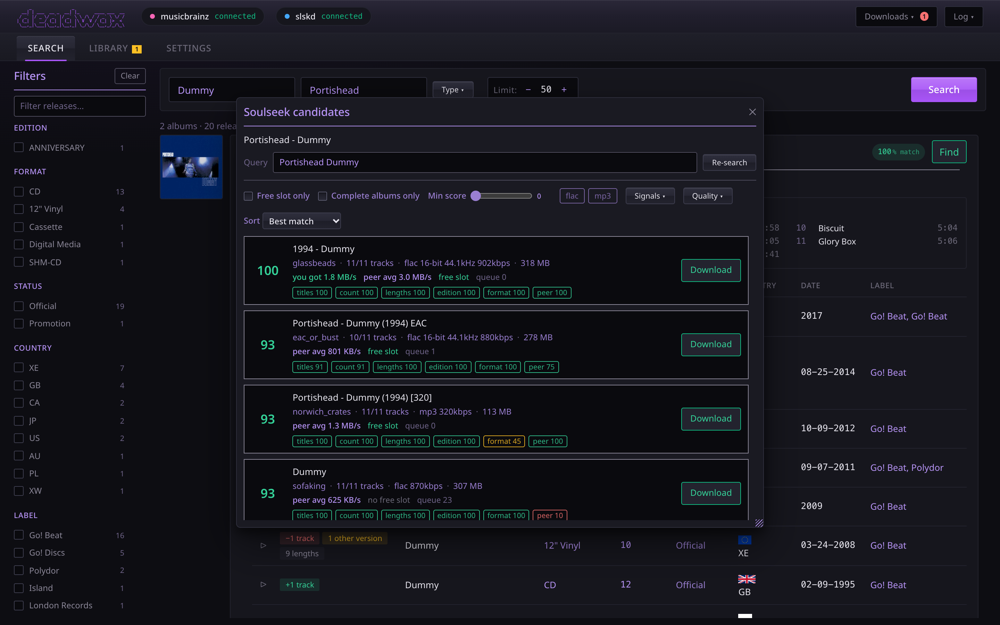
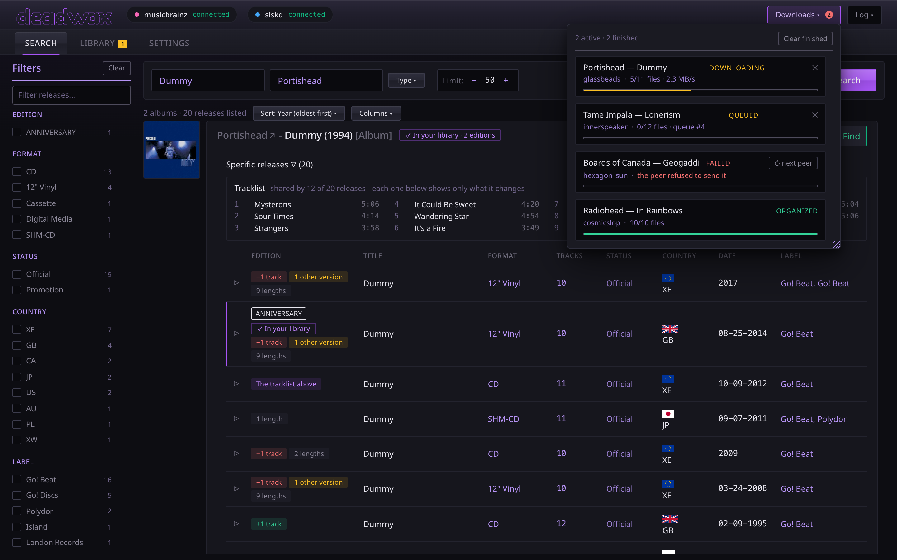

# Downloading

**Find**, on a pressing or an album, opens the **Soulseek candidates** panel. It searches
Soulseek through slskd, ranks every folder that comes back, and lets you download the one you
want. The **Downloads** panel then follows it until it's filed.

## The search it runs

The query is the artist and the album title. It's searched under **every name the artist goes
by**, because a sharer's folder is named however the album was credited when they got it:

- the name on the release (the credit, as in "Kanye West" on *Donda*);
- the artist's current name ("Ye"), which is what deadwax files under;
- former names MusicBrainz marks as ended.

The searches run side by side, so an artist with two names costs barely more than one. The
**Query** box shows the first query; hover over it to see the others. Edit the query and
press **Re-search** (or Enter) to search for exactly what you typed instead. An unedited
**Re-search** searches every name again. How long each search waits for answers is
`SLSKD_SEARCH_TIMEOUT`, 8 seconds by default.

Close the panel or start another **Find** mid-search, and the search is stopped in slskd as
well: only the newest search's answer is ever shown.

## When you already have it

Before it searches, **Find** looks for the pressing you picked in your library and in your
downloads, by its MusicBrainz release id:

- **Already in your library**: every track of that pressing is there. Soulseek isn't searched.
  The panel shows the folder, how many of its tracks it holds ("10 of 10 tracks") and in what
  format, and there's nothing to download.
- **Already downloading**: a download of that whole pressing is queued or arriving. Soulseek
  isn't searched for this either. The panel names the user it's coming from and how far it has
  got ("queued", "4 of 10 files"). To try another user, cancel it in Downloads and press **Find**
  again.
- **Part of it downloading**: a download of only some of its tracks is under way, such as one
  disc's folder on its own (fewer files than the pressing has tracks). It will never bring the
  rest, so the search runs as usual, with a note above the results naming the user and how far
  it has got.
- **Already downloaded**: every file of a download of it has arrived and it's being filed into
  your library right now. There's nothing to cancel; once it's filed, **Find** says what your
  library holds of it.
- **Part of it held**: the library has some of its tracks but not all. The search runs as usual,
  with a note above the results: "You have 9 of 10 tracks of this pressing, in *folder*." The
  note then says what a download would do, because that depends on where it would be filed:
  - "Downloading it files only the tracks that folder doesn't have yet": the part you have is
    in the folder a download of it is filed into, so the tracks already there aren't filed a
    second time.
  - "A download would be filed separately, in *folder*, rather than fill in that folder": the
    part you have is in a folder named some other way (by Picard, or by an older folder naming
    template), so a download is filed as a separate folder, tracks you have included.
- **Another pressing of the same album held**: the search runs, with a note for each pressing
  you have, "You also have another pressing:" and its edition (or year), format and folder. This
  note shows beside the others as well.

What counts as held is checked on disk every time: the folder has to still be there, with its
files tagged as that release (deadwax reads the first one), and what's counted is the release's
tracks it holds. Each file is matched to a track by its title first, so a set numbered across
its discs, or a stray disc number, still counts; a file whose title isn't the release's (or
that has none) is matched by its disc and track number instead. A track you have twice, as FLAC
and MP3 say, counts once, and audio that isn't one of its tracks doesn't count. A folder whose first file
isn't tagged as that release, such as one shared with untagged files from before deadwax,
doesn't count, so the download goes ahead and filing skips whatever tracks the folder already
has (see [organizing](organizing.md)). An album copied in by another program counts once a scan
has seen it: opening the library tab, or **Rescan**. A card's **Find** that couldn't pick a
pressing, because MusicBrainz didn't answer, has no release id and isn't checked.

The tracks of a DVD-Video or Blu-ray in a pressing (a deluxe edition's concert film, say), and
any track MusicBrainz lists as a video, aren't counted: they never arrive as audio, so a pressing
is complete once you have all of its audio. A plain "DVD" is counted as audio unless MusicBrainz
marks its tracks as video, since it may be a DVD-Audio disc.

The same check stops a second copy getting through another way:

- **Download** is refused, and the row in Downloads says why ("already in your library: *folder*"
  or "already downloading from *user*"), when the album was filed or started somewhere else (in
  another tab, say) after the panel opened. Two presses at once only ever queue one download. A
  download of only part of the pressing refuses nothing.
- **↻ retry** and **↻ next peer** don't start a download again once that pressing has been filed
  complete, while another download of all of it is under way, or when the download has already
  been retried meanwhile (from another tab, or by `AUTO_RETRY_PEER`) or cleared from the list.
  The row shows the reason while it is still stopped. `AUTO_RETRY_PEER` makes the same check,
  and says why it didn't retry in the event log (except when a click on the row got there first,
  which isn't a failure).

## Reading a candidate

Each row is one folder on one user's share, or one set of folders: an album shared one folder
per disc (`CD 1`, `CD 2`) is one row, marked **2 disc folders**, and downloads as one album.
It stays split only when the release you picked is a single disc, since one disc of a bigger
set can be exactly that album. A disc folder on its own is named with the album folder above
it (**Wish You Were Here / CD 2**).

- **The score**, 0 to 100, is how well the folder matches the release you picked. Green is
  good, yellow is middling, red is poor. How it's worked out is in
  [How matching works](matching.md).
- **The folder's name**, and below it the **user**, how many **files**, the **format and
  quality** (`flac 24-bit 96kHz`, `mp3 320kbps`, with ranges when files differ, and `VBR` for
  variable bitrate), and the folder's total **size**.
- **Peer speed.** `peer avg 1.2 MB/s` is the user's own average upload rate over their whole
  history, shared between everyone they're serving; it isn't a prediction. When you've
  downloaded from this user before, **the rate you actually got** is shown first, in green. A
  **free slot** means they'll start sending straight away; otherwise **queue N** is how many
  people are ahead of you.
- **Edition words** found in the folder's name (REMASTER, DELUXE, …).
- **Signal chips**, the score broken down: titles, count, lengths, edition, format, peer.

## Narrowing the list

- **Free slot only** and **Complete albums only** hide busy peers and folders missing tracks.
- **Min score** hides anything below a score.
- **Format chips** (flac, mp3, …) show only those formats. They're built from what the search
  found.
- **Signals** sets a minimum for each part of the score separately. The number on the button
  counts how many are set.
- **Quality** sets floors: a minimum **bitrate**, **bit depth** and **sample rate**, and an
  album **size** range in MB. A folder is judged by its *worst* file, and a folder whose files
  don't report a value doesn't pass a floor for it, with one exception: a lossless folder
  passes any bitrate floor, because lossless beats any lossy bitrate.
- **Sort**: best match, highest quality (lossless first, then bit depth, sample rate and
  bitrate), largest, or smallest.

The filters' starting values, and the sort, are set in Settings → Downloads.

## Downloading

Press **Download** on a row. The folder's audio files are queued in slskd, and a row appears in
the Downloads panel **straight away**, reading "asking slskd…" while slskd looks the user up
and connects. That can take several seconds for a firewalled peer. If slskd refuses (the user is
offline, say), the row says so in slskd's own words.

Only the audio is downloaded. The rest of the list is kept with the download, in the order
you were looking at it, for **Try next peer** (below).

**Auto-grab** (Settings → Downloads) downloads the top candidate by itself on a new **Find**,
when it scores 75 or more. The panel says when it has done so.

## The Downloads panel

The **Downloads** button (top right) opens the list, with a badge counting what's still going.
Each download shows the album, the user, a progress bar, and a line of detail: files done out of
files wanted, **queue #N** while waiting in the user's queue, and the live download speed.

| status | means |
| --- | --- |
| queued | slskd has it, and it's waiting for the user to start sending |
| downloading | files are arriving |
| complete | every file arrived, and organizing hasn't started yet, or it ran into a problem, which the line says |
| organizing | being tagged and filed |
| organized | filed into your library (or, in dry run, checked) |
| failed | it stopped for good, and the line says why |
| cancelled | you cancelled it |

When a download is filed, the library tab picks the new album up by itself.

### When a download fails

The reason is shown on the row: the user refused the transfer, stopped responding, the transfer
errored, or slskd never reported the transfers at all (after about two minutes of looking).

**↻ retry** asks the same user again. Only the files that didn't arrive are asked for, and
slskd can pick a partly downloaded file up where it stopped (unless a cancel deleted it; see
below). It's the one to try when a user was briefly offline or a transfer timed out. If slskd
is still stopping the last attempt, the row says to try again in a moment, and a refusal shows
the reason, as with any download.

**↻ next peer** moves the download to the next user from the list you picked it from,
skipping any user already tried. It asks up to three in turn until one accepts, and the row
then reads **try 2**, **try 3** and so on. The old attempt's transfers are cleared out of
slskd. The button disappears when there's nobody left to try. With `AUTO_RETRY_PEER` on, this
happens by itself when a download fails.

### Cancelling

**✕** on a running download cancels it (with a confirmation, unless you've turned that off).
The row shows "cancelling…" at once, and the transfers are removed from slskd's own list too.
If `SLSKD_INCOMPLETE_PATH` is set, the half-finished file slskd was writing is deleted as well;
otherwise slskd keeps it, which is its normal behaviour.

**Clear finished** removes finished, failed and cancelled downloads from the list.

## On the phone: the Requests tab

[The phone app](player.md) at `/player/` shows the same downloads in its **Requests** tab, with
the same buttons. Starting a download is still on the main page for now; watching it, and dealing
with one that failed, works from the phone.

- **Downloading**: the album, who it's coming from, a progress bar and files done out of files
  wanted with the live speed ("6 of 10 files · 1.8 MB/s"). **✕** cancels it. It asks first, in
  the card itself - "Cancel this download? You'll lose your place in this peer's queue.", with
  **Keep it** and **Cancel download** (tap the ✕ again to close the question) - unless **Confirm
  before cancelling** is off on that device; the home-screen app keeps its own storage and always
  asks. It never puts up a pop-up dialog, which would hold up the music playing in the same app.
  Once you cancel, the row reads "cancelling…" at once, its cover and title faded. A download
  being filed into your library reads "organizing", with nothing left to cancel.
- **Waiting**: queued in the user's queue, with its place there when slskd says ("#4 in their
  queue"), or "starting" before it does, with a **✕** too. If the user has already refused some of
  its files while the rest wait, it says so in amber ("#4 in their queue · 3 failed"): those files
  won't come, and the download will end as failed unless you move it to another user.
- **Needs attention**: a failed or cancelled download, with why in red. **Next peer · 2 left** moves
  it to the next user from the list it was picked from, and **Ask again** asks the same user for
  the files that didn't arrive - the main page's **↻ next peer** and **↻ retry**, below
  [When a download fails](#when-a-download-fails). While one runs the button says so ("Trying next
  peer…", "Asking again…") and both wait, and if nobody would take it, why is shown under the
  reason. A download moved to another user says "try 2", "try 3" and so on. On a narrow phone the
  two buttons stack, so neither loses its words.
- **Done**: how it ended, and how long ago ("In your library · 12 minutes ago"). The other endings:
  **Already in your library, nothing filed** (every track was already in the album's folder; the
  download itself is still in slskd's folder), **Partly filed** (some files couldn't be written into
  the library and some tracks were; see
  [troubleshooting](troubleshooting.md#a-download-says-n-files-failed-to-organize)), **Interrupted
  while filing** (deadwax stopped part-way; see
  [troubleshooting](troubleshooting.md#a-download-says-deadwax-stopped-while-filing-this)), **Not
  filed** with the reason (organizing in dry run, say, or "no track was filed"), and **Downloaded,
  not filed** when organizing is off - `ORGANIZE_MODE` set to `off`, or `LIBRARY_PATH` or
  `SLSKD_DOWNLOAD_PATH` not set (Settings → Library names which; see
  [troubleshooting](troubleshooting.md#downloads-finish-but-nothing-appears-in-my-library)).
- **Clear done**, at the top, does what **Clear finished** does: it removes every finished, failed
  and cancelled download, the ones under Needs attention included.

Each album shows its cover from the Cover Art Archive (the pressing's front cover), or a plain
square when there's none, or no internet to fetch it from.

Once albums can be got in the app itself (a later step), a download asked for there will show from
the tap, under Waiting as "asking slskd…" until slskd answers, or under Needs attention in slskd's
own words if it refuses - as the main page's Downloads panel shows one asked for on the main page.

The **Requests** tab carries a count of the downloads on their way, and **Home** shows up to three of
them under **Arriving**, above Recently added, with **See all** (or a tap on one) going to the list
on Requests - even if you'd left an album open on that tab. When nothing is on its way, Home has no
Arriving section at all. The app looks at the downloads every half second while Requests is open,
keeps looking every few seconds while anything is on its way, and otherwise stops; it looks again
whenever Home comes into view and whenever you come back to the app, so a download started on the
main page shows up without anything left running. If deadwax stops answering while something is on
its way (restarting, or the phone off your network for a moment), the app keeps asking every half
second until it answers, and Arriving says that what it shows is deadwax's last answer.

## The event log

The **Log** button shows what's happening behind the scenes: searches, how many answers came
back, queueing, filing, and anything that went wrong, with slskd's or MusicBrainz's own words
where there are any. A badge counts warnings and errors you haven't seen.
