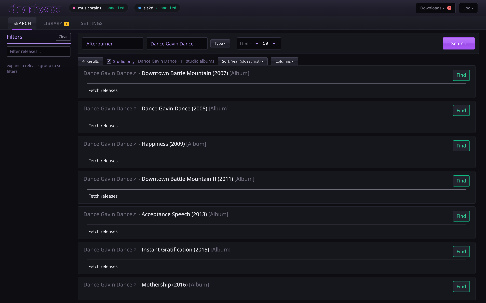
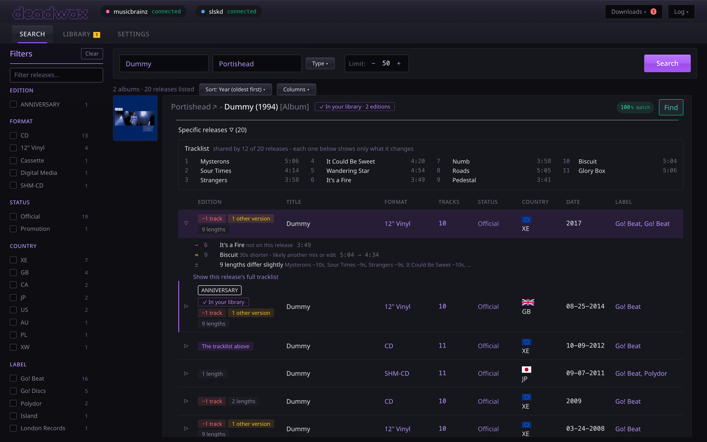

# Finding music

The **Search** tab looks up albums on MusicBrainz and lists every pressing of each. You choose
the exact one you want, and that's what the download is matched against and tagged as.

This page is about the main page's Search tab first. The [phone app](player.md) has a Search tab
of its own, with one box that looks in your library first and then on MusicBrainz, and a page for
an album you don't have: see [On the phone](#on-the-phone-the-apps-search-tab).

## Searching

Fill in either box or both:

- **Release title**: the album's name.
- **Artist name**: who it's by. With both filled in, the search asks for that album by that
  artist, which is far more precise than typing both into one box.

Then press **Search**, or Enter in either box.

- **Type** narrows what's asked for: albums, singles, EPs, or other, and **studio albums only**,
  which leaves out live albums, compilations, interviews, demos, remixes and DJ mixes. It
  narrows the *question* rather than hiding answers. MusicBrainz returns a limited number of
  results, so for a prolific artist most of them would otherwise be live albums and
  compilations. When a type filter is on, the button, the results summary and its tooltip all
  say so.
- **Limit** is how many albums to ask for (1-100). The default is set in Settings → Search.

## The results

Each result is a card for one album (a *release group*):

- the **cover**, **title** and **year**, and the **type** (Album, Single, Live, Compilation…);
- the **artist**. Tap or click the name to browse the artist's whole discography (below);
  the **↗** beside it opens the artist on MusicBrainz;
- a **match** percentage, MusicBrainz's own relevance score for your search. Green is a strong
  match; a faded card is a weaker one;
- **In your library** when you already hold some pressing of it, with a count of editions, or
  **Maybe in your library** (dashed) when a folder of that name exists but carries no MusicBrainz
  ids to prove it;
- **Find**, which searches Soulseek for the album as a whole (see below).

**Sort** orders the cards: year (oldest or newest first), best match, title or artist. Albums
with no known date go to the end whichever way the list runs.

## An artist's discography

A search can't answer "everything this artist released, in order": MusicBrainz answers in
relevance order and spends the limit on whatever matched, which for a well-known artist is
mostly bootlegs. So clicking an **artist's name** *browses* instead. It lists every album
credited to them, in the order **Sort** says (oldest first by default), with **studio albums
only** on to start with. **Back** returns to your search.

A browse stops at 500 albums, and says so if it did, so an enormous catalogue ("Various
Artists") isn't presented as complete.

## Every pressing of an album

Under each card is a list of its **releases**: every pressing MusicBrainz knows of. The best
match comes with them already fetched, marked **Specific releases (N)**; for the others, press
**Fetch releases**. MusicBrainz can take a few seconds, sometimes much longer on a bad day, and
the button shows it's working.

The list is a table on a desktop and one block per pressing on a phone. Its columns:
**Edition**, **Title**, **Format**, **Tracks**, **Status**, **Country**, **Date**, **Label**,
**Catalog#**, **Barcode**, **Quality**, **Language/Script** and **Disambiguation**. **Columns**
chooses which are shown. On a desktop, drag a column's header to move it and its edge to
resize it; the layout is remembered.

### What's different about each pressing

Above the list is **the tracklist most of the pressings share**, and each pressing then says
only what *it* changes:

- **The tracklist above**: this pressing is the shared one.
- **+1 track** / **−1 track**: bonus tracks, or missing ones.
- **1 other version**: a track that's a different recording (much longer or shorter), such as
  a single mix.
- **3 lengths**: tracks whose lengths differ slightly; rounding within 2 seconds doesn't count.
- An **edition** label, such as *ANNIVERSARY*, *REMASTER* or *DELUXE*, when the release names one.

Click (or tap) a pressing to see its changes in full, and click **Show this release's full
tracklist** for the whole thing, sides and discs included.

### Pressings you already have

A pressing whose MusicBrainz id matches an album in your library is marked **In your library**,
with a purple edge. The marks update by themselves when a download is filed while you're
looking.

**Find** on a pressing you already have complete, or one that's already downloading in full,
says so instead of searching Soulseek. See [when you already have it](downloading.md#when-you-already-have-it).

## The filter column

On the left (behind **Show** on a phone), the filter column is built from whatever release
lists are open: every edition, format, status, country, label and so on that appears, with
counts. Click a value once to show **only** pressings with it, again to **exclude** it, and a
third time to clear it. The text box filters on anything in a row. **Clear** resets everything.
The results summary says how many pressings are shown out of how many were listed.

## Find: starting a download

There are two **Find** buttons, and the difference matters:

- **Find on a pressing's row** (recommended) searches Soulseek for that exact release, and ranks
  every folder found against **its real tracklist**: titles, count and lengths. When the
  download is filed, each track gets that release's title, number, disc and ids.
- **Find on the album card** is for when you don't mind which pressing. It picks one for you:
  a pressing with the album's most common tracklist, preferring an official CD or digital
  release, then the earliest. It then searches exactly as that pressing's own Find would. If the
  card hasn't listed its pressings yet, the button shows a sweep while it asks MusicBrainz, and
  if MusicBrainz can't answer, it falls back to searching for the album as a whole.

Either opens the **candidates panel**; see [Downloading](downloading.md). If the pressing is
already in your library, or already downloading in full, the panel says so and doesn't search.

## On the phone: the app's Search tab

The [phone app](player.md) at `/player/` has its own **Search** tab (since 2.0.0-player.13): one
box, **your library first, then MusicBrainz**. Since 2.0.0-player.15 it gets albums too: **Get** on
a row of albums you don't have, or **Get the album** on an album's page, opens the sources found on
Soulseek to choose from - see [Get, and choosing a source](downloading.md#on-the-phone-get-and-choosing-a-source) -
and the app's Requests tab follows the download from there.

### The box

Type an artist, an album, a song, or an artist and an album ("portishead third"), up to 200
characters. Each half is asked by itself:

- **Your library** is asked a fifth of a second after you stop typing.
- **MusicBrainz** is asked when you press **Search** on the keyboard, or 0.7 seconds after you stop
  typing once there are 3 characters or more. Fewer than 3, and it waits for Search: it says *Type
  a little more, or press Search, to ask MusicBrainz.* - and cutting the box back below 3 clears
  what MusicBrainz found for the longer text (and calls off a search still on its way), so its
  albums never sit under words they don't answer. MusicBrainz allows about one request a second,
  so it isn't asked on every key.

Only the newest search is ever shown: an answer that arrives after you've typed something else,
and searched again, is dropped.

### In your library

Navidrome's own search of your library, in three parts:

- **Top result**: an artist whose name is exactly what you typed, with how many of their albums
  you have ("Artist · 2 albums in your library"). Tap it for [their page](player.md#artist-pages)
  (since 2.0.0-player.17).
- **In your library**: the other artists found (up to 5 in all, each opening their page), albums
  ("Album · Portishead · 1994"), which open the album, and songs ("Song · Portishead · Dummy"). Up
  to 8 albums and 12 songs.
- **A song** plays straight away, from that song through the rest of its album, once its album is
  in hand: as the answer arrives, the songs' albums are fetched - the first five different ones -
  and a song whose album has arrived shows a play mark (▶) at its right. Tap one without it, and
  its album opens instead, where Play is one tap away.

If nothing matches, it says *Nothing in your library matches "…"*. If Navidrome isn't set up or
can't be reached, this half says so (**Connect Navidrome** or **Can't reach Navidrome**, as Home
does) and MusicBrainz is still searched below it.

### Not in your library yet

From MusicBrainz, up to 12 albums, **leaving out any you already have** - judged by MusicBrainz's
own id for the album, so a folder deadwax filed as FLAC or MP3 (or one tagged by Picard) is
recognised. A folder with no MusicBrainz ids in its tags can't be, and nor can an **.m4a album
deadwax filed**: it carries the pressing's id but not the album's (Picard writes that one; deadwax
can't yet), so its album still shows here - its own page then says "in your library". To leave
those out the list waits a moment (a second and a half at most) for deadwax to say what you have,
showing **Asking MusicBrainz…** meanwhile; if deadwax answers later than that - the first time
after it restarts, when it looks through the whole library - a row it turns out you have stays
where it is and says "· in your library" at the end of its second line, rather than vanishing from
under your finger. Each row is the
cover (from the Cover Art Archive, so a phone with no internet shows a plain square), the title,
and what it is, who by and when ("Live album · Portishead · 1998"). Tap one to open
[the album you don't have](#the-album-you-dont-have). **Get**, at the end of the row, gets the
album's usual pressing without opening it (it reads "Get…" while it asks MusicBrainz for the
album's pressings, which an album opened before already has, and gives up if you type, open
something or switch tab meanwhile); a row that turns out to be in your library has none, and a tap
on it opens **the album you have** (since 2.0.0-player.17: deadwax looks up which album Navidrome
holds for the pressing you have) - or, while Navidrome hasn't found it, the album you don't have,
which says "in your library".

How the box is read, since there's only one:

- **It starts or ends with an artist you have** (any folder in your library, by name, ignoring
  case, accents, a leading "The" and "&" against "and"): the rest is the album's title, and
  MusicBrainz is asked for that album by that artist, under the name they had then or have now.
  "portishead third" and "third portishead" both find Third. The longest name that fits wins, so
  "pink floyd the wall" is The Wall by Pink Floyd even if you also have Pink. A dash, colon or
  slash between the two is ignored ("portishead - third").
- **It is an artist you have**: their albums.
- **va**, or "various artists", is Various Artists, as the main page's artist box reads it.
- **Anything else** goes to MusicBrainz as you typed it.

If reading it as an artist and an album finds nothing (an artist's name that happens to begin a
title), it's asked again as the words you typed. While it asks, it says **Asking MusicBrainz…**
with a moving bar. If MusicBrainz isn't answering - it often goes away for a few minutes - it says
so, with **Try again**; that's not the same as *Nothing on MusicBrainz for "…"*, which means it
answered and found nothing. *Everything MusicBrainz found is in your library already* means just
that.

### The album you don't have

It opens like an album you have: back, the cover in the middle (the Cover Art Archive's, for the
pressing shown, else for the album), the title, the artist (since 2.0.0-player.17 a link to
[their page](player.md#artist-pages) when the album is credited to one artist; a collaboration's
names stay plain), and "2008 · Album ·
not in your library" - "in your library" if you have some pressing of it after all. That last part
appears once deadwax has said what you have, never before, so it can't claim you don't have an
album you do; and it counts a folder tagged with any of the album's pressings, the .m4a albums
above included. Opened from a saved link or after a reload it says the same, since the album's
title, kind and year come with its pressings. A link whose address isn't a MusicBrainz album says
*That isn't a link to an album on MusicBrainz.* Under it is the **Pressing** button, where an album you have has Play and
Shuffle; then **Get the album**, the page's one purple button, which gets **the pressing chosen**
([Get, and choosing a source](downloading.md#on-the-phone-get-and-choosing-a-source)); under it,
what you already have of that pressing, if anything ("Already in your library", "Already
downloading", "You have 9 of 10 tracks of this pressing…", "You also have another pressing…" -
asked of deadwax without searching Soulseek, for the pressing chosen, and again as you come back to
the page); and then **that pressing's tracklist**.

It needs only MusicBrainz, so it works with Navidrome down. To work out the differences it fetches
**every pressing's tracklist** at once, which for an album with a lot of pressings can take
several seconds (**Asking MusicBrainz…**); after that it's kept for as long as the app is open (the
last 20 albums you opened), so going back to it asks nothing again. If MusicBrainz isn't answering, it says so with **Try again**
rather than showing part of the list as if it were all of it.

**The Pressing button** says which pressing you're looking at: its format, year, country (left out
for a worldwide release; "Europe" for MusicBrainz's European ones) and its MusicBrainz
disambiguation, or else its label - "CD · 2020 · AU · Caroline International". It starts on **the
usual pressing**: one with the album's most common tracklist, an official release over a promo or
bootleg, a CD or digital release over vinyl, one with no disambiguation, then the earliest. That's
the pressing a card's **Find** on the main page downloads as, and the one a row's **Get** gets.

Tap it for the list of pressings, each with a note of how it compares. It opens below the button
and, on a phone, scrolls the page so the whole list is in view above the tab bar and the mini
player (it's never taller than that, and scrolls inside itself past that):

- **The usual tracklist · shared by 9 of 10 pressings** on the one it starts on;
- **Same tracklist as the usual one**: one pressing of each other format that has it (so a vinyl
  is a tap away);
- every pressing that differs, its note in amber: **+1 bonus track: Patience**, **Without It's a
  Fire**, **1 other version: Borderline, 4:34**, **2 tracks renamed**;
- **No tracklist on MusicBrainz** for one nobody has entered the tracks of;
- then **N more pressings with the usual tracklist**, folded away - tap it to show them.

Choosing one shows its tracklist and closes the list, and the page's address remembers it, so a
reload or a saved link shows the same pressing; Back still leaves the page in one step. A tap
outside the list, or Escape, closes it without choosing.

**The tracklist** is the chosen pressing's own: its titles and lengths, numbered on each disc, with
disc headings for a set - "Disc 2 · Unreleased Tracks" when MusicBrainz gives the disc a title, as
an album you have shows the titles deadwax writes into your files. The line above it says what this
pressing is against the usual tracklist: *The usual tracklist, shared by 9 of 10 pressings*, *Same
tracklist as the usual one*, or, in amber, *This pressing adds 1 track* (or *leaves out*, *renames*,
*has another version of*). A track that differs is marked in its row:

- **Bonus**, in green, *Only on this pressing*: a track the usual tracklist hasn't got.
- **Other version**, in amber, *The usual version is 3:58*: the same title, but a different
  recording - 15 seconds or more longer or shorter (or 8% of the track, if that's more), like a
  single mix.
- **Renamed**, in amber, *Usually "…"*: a new title at about the same length.
- **Not on this pressing**, after the list: the usual tracks this one leaves out.

"The usual tracklist" is the titles in order, as on the main page, at the lengths of the pressing
the page starts on - so that pressing is always the usual one, whatever order MusicBrainz lists
them in. A pressing whose tracks are a few seconds longer or shorter (MusicBrainz's rounding, or
that pressing's own timing) still has it. The thresholds are the main page's own ([What's
different about each pressing](#whats-different-about-each-pressing)) - 15 seconds (or 8% of the
track, if that's more) for another version, within 5 seconds for a rename - but the app doesn't
mark a small length change at all, where the main page shows it as an "N lengths" chip: such a
pressing reads *Same tracklist as the usual one* here.
