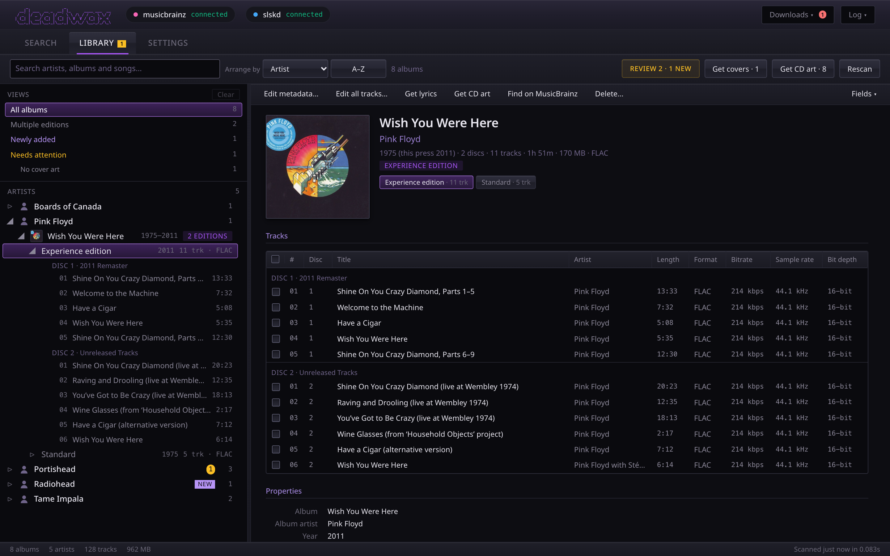
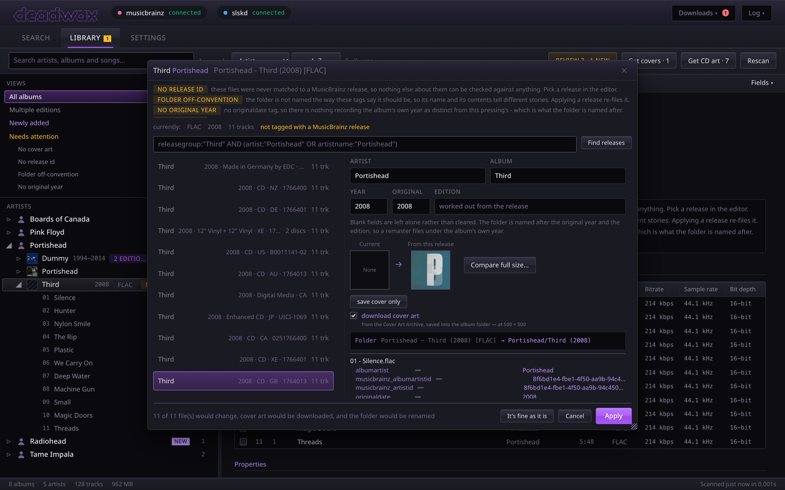
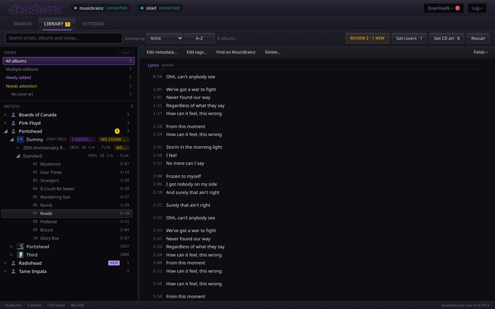
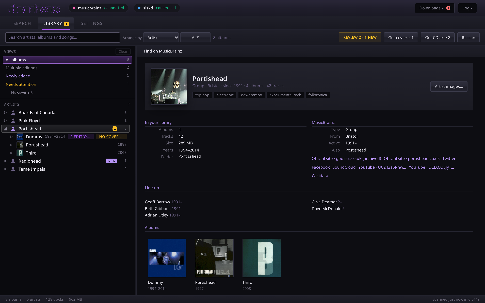
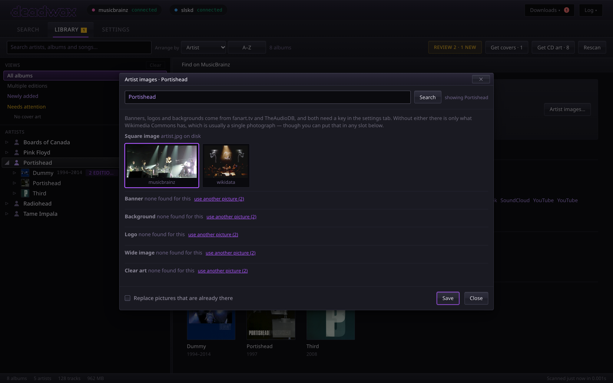

# The library

The **Library** tab shows what's in your music folder (`LIBRARY_PATH`): every album, including
ones deadwax never downloaded. It flags what's wrong with them and lets you fix it.

## Opening it

The first time, the tab reads the tags off every file, which takes a while for a big library.
The result is saved, so every visit after that draws the saved copy **at once**, marked with its
age, and checks the folders for changes underneath it. Only folders that changed are read
again.

Albums filed from a download appear by themselves. **Rescan** re-reads everything, and is what
to press after changing files with another program: a tag edited elsewhere doesn't change a
folder's date, so it isn't noticed otherwise.

The status bar at the bottom counts albums, artists, tracks and size, and says when the library
was last scanned.

## The tree

Laid out like a file explorer: **artists**, their **albums** underneath, and the **tracks**
under an album. An album you hold more than one pressing of says **N editions** on its row, and
opens to one row per edition first.

- **Click** a row to select it and open it. The **triangle** opens and closes without
  selecting.
- **Keyboard**: up and down move, right opens (or steps in), left closes (or steps out), Enter
  toggles, Home and End jump to the ends.
- Rows carry small chips: **New** for albums filed since you last looked, the first
  **issue** that needs attention, and the edition count.
- On a phone, tapping an album or a track opens its details as a sheet; tapping an artist opens
  it in place, and **tapping it again** opens the artist's page.

It stays quick on a big library: only the rows in view are ever drawn.

### Arranging

**Arrange by**: **Artist** (the tree above), **Album**, **Release date** or **Date added**.
The last three list albums directly under headings (a letter, a year, a month). **A–Z** flips
the direction. "Date added" is when deadwax first saw the album, or its folder's date if that's
earlier, so a library that was there before deadwax still sorts sensibly.

### Searching

The search box matches artists, albums, editions, and **song titles** (from two letters). A song
match opens its album and shows just the matching songs. Every artist with a match opens by
itself.

### Views

The views list narrows the tree (behind **Show** on a phone):

- **All albums**;
- **Multiple editions**: albums you hold more than one pressing of;
- **Newly added**: filed from downloads since you last looked at them;
- **Needs attention**: anything with an outstanding issue (below), and one view per issue.

## The details pane

Whatever you select shows on the right (a sheet on a phone):

- **Nothing selected**: the library's totals, and the most recently added albums.
- **An album with several editions**: a table of the editions, each with its year, tracks,
  length, size, format and anything it needs.
- **An album**: the cover (click it for the [cover viewer](#the-cover-viewer)), its facts, a pill
  for each edition, the **tracks**, and **Properties**: every tag that matters, where the cover
  came from, whether tracks carry their own pictures, CD art, and lyrics.
- **A track**: every tag in the file, the pictures embedded in it, and its lyrics.

The command bar across the top holds the album's actions: **Edit metadata…**, **Edit all
tracks…** (or **Edit N tracks…** with some ticked), **Get cover**, **Get lyrics**, **Get CD
art**, **Find on MusicBrainz** and **Delete…**. On a desktop, **Fields ▾** chooses the track
table's columns.

### The track table

Choose its columns from **Fields ▾** (or by right-clicking the header): tags, audio details,
MusicBrainz ids, file details. Drag a header to move a column, drag its right edge to resize
it, and double-click the edge to reset it. On a phone the table is always number, title and
length.

A tag that's only in the file (not the saved scan) shows `·` until the files have been read. A
disc number shown faded is a default: the file has no disc tag, so it counts as disc 1.

A multi-disc set is split under **Disc 1**, **Disc 2** headings, here and in the tree. A disc
that has its own title says it too: **Disc 4 · Live at Wembley 1974**, and so does a set kept
one folder per disc, on each folder's row. The title is the
`DISCSUBTITLE` tag (Picard's name for it; Navidrome shows it as well). deadwax writes it when a
download or an applied release gives the disc a title, and you can set it by hand (below). The
**Disc title** column shows what each file carries, including one that disagrees with the rest
of its disc.

## What needs attention

Each album is checked for these, fresh on every scan:

| issue | means | the fix |
| --- | --- | --- |
| No release id | never matched to a MusicBrainz release, so nothing else can be checked | pick its release in the metadata editor |
| No artist tag | no file names an artist, so the name shown came from the folder | apply a release |
| Mixed tags | the files disagree about which album they're from, often two albums sharing a folder | sort the files out, or apply a release |
| Split across folders | this folder holds only some discs of a release whose other discs are elsewhere | apply the release to each; the second merges into the first, which keeps anything you'd said was fine about it |
| Artist under two names | the artist's albums are under two folder names, usually a rename | **Move albums to …** on the artist's page |
| Folder off-convention | the folder isn't named the way its tags say it should be | apply its release, which re-files it |
| No original year | no `originaldate` tag, which the folder name uses | apply a release |
| No year | no date on any file | apply a release |
| Untitled tracks | some files have no title tag, so filenames are shown | apply a release |
| Unnumbered tracks | some files have no track number, so the order is alphabetical | apply a release |
| No cover art | no cover beside the tracks or inside them | **Get cover** |

**Review N**, in the toolbar, walks through every album that needs attention (and every album
newly filed), one at a time, in the metadata editor. For an album that's right as it is (a
bootleg that will never be on MusicBrainz, say), **It's fine as it is** stops it being flagged
for the issues it has now. It's still flagged if something new goes wrong, such as the cover
going missing.

## The metadata editor

**Edit metadata…** opens the editor on an album, already searching MusicBrainz using its artist
and album tags. You:

1. **Pick the release** the album really is from the list of pressings. The one the files
   already claim is marked **Current**. Each row shows year, format, country, catalogue number
   and track count; a track count in yellow doesn't match the files.
2. **Check the fields**: artist, album, year, original year, and edition. Blank fields are left
   alone rather than cleared. The edition is worked out from the release unless you type one.
3. **Read the preview**. It shows every tag that would change, file by file; whether the folder
   would move or be renamed (to follow the template, or the artist's current name); and, when
   the album is split across folders, whether it would merge.
4. **Cover art**: tick **download cover art** to save the release's cover from the Cover Art
   Archive, and compare it with the one you have (**Compare full size**) before replacing it.
5. **Apply** writes the tags, fetches the cover and moves the folder. There's no undo, which is
   why the preview shows everything first. When the apply changes both the album's tags and its
   folder, it writes the tags, pauses (20 seconds by default, `RETAG_RENAME_WAIT`), then
   renames. That pause lets Navidrome see the new tags first and keep the album's plays,
   ratings and favourites, which it loses when both change at once. The preview says so, and
   the button counts it down. If a folder of the new name appears during the pause (another
   copy of the same release applied just before), the rename is refused and the album stays
   where it is, with its new tags.

## Editing tags by hand

Tick tracks in the track table (Shift-click for a range, Ctrl/Cmd-click for one at a time), then
**Edit N tracks…**, or **Edit all tracks…** with none ticked. You can edit title, artist, album,
album artist, track, disc, disc title, date, original date, genre and composer. A disc title is
the one to set for a box set or a bootleg whose discs MusicBrainz leaves untitled: tick that
disc's tracks and type it once.

- A field whose value differs between the ticked tracks starts empty and says **Several
  values**. Leave it alone and each track keeps its own.
- Only fields you change are written. Emptying a field you changed **removes** that tag.
- The preview shows each change before **Apply**. If anything is invalid (a track number that
  isn't a number), nothing is written at all.
- It edits tags only; no file or folder is renamed.

## Covers, CD art and lyrics

- **Get cover** fetches the cover of the release the album's tags name, from the Cover Art
  Archive, at `COVER_ART_SIZE`, and saves it as `cover.jpg` (or `.png`). It only appears on albums
  that have a release id and no cover, and it never replaces one. To replace a cover, use the
  metadata editor, where you can compare the two. **Get covers · N** in the toolbar does every
  album in view that's missing one, one at a time; press it again to stop. "No cover on the
  Archive" and "the request failed" are counted separately, because only the second is worth
  trying again.
- **Get CD art** saves a picture of the disc itself, as `disc.jpg` (or `disc1.jpg`,
  `disc2.jpg`… per disc of a set), from the Cover Art Archive's scans of that exact release, and
  otherwise from fanart.tv if you've set a key. Navidrome shows it for the songs on that disc.
  **Get CD art · N** does every album in view.
- **Get lyrics** looks up lyrics on LRCLIB for the tracks that have none, and saves each as a
  `.lrc` beside its track. The button then reports how many it found (**Lyrics · 9 of 10**, with
  the details in its tooltip). **Get lyrics · N** does every album in view that has no lyrics at
  all.

**Why a song can show a different picture from its album:** some players (Navidrome, and so
apps like Amperfy) show a picture *embedded in the file* over the album's cover, and a disc scan
(`cd.jpg`) for songs with a disc number. An album's **Properties** and a track's view list the
pictures inside the files, so you can see which it is.

### The cover viewer

Click an album's cover to see it full size. Click (or tap) to zoom in on the point you touched,
use the wheel to zoom, or pinch on a phone; drag to move around; click again to fit. In the
metadata editor it shows your cover and the release's side by side.

## Artist pages

Select an artist (on a phone, tap it twice) for their page: a photograph, the facts MusicBrainz
has (type, origin, active years, other names, members), links, and their albums in your library.
Two links of the same kind say where each one goes (**Official site · portishead.co.uk**, and
**(archived)** for a page kept on the Wayback Machine), and every link's full address is in its
tooltip.

Which artist this is comes from the files' MusicBrainz artist ids. When the files have none, a
name search is used, but only when exactly one artist has that name. For a name several artists
share (there are eight called Nirvana), the page asks you to choose.

**Artist images…** shows every picture found, from Wikimedia Commons, TheAudioDB (with a key)
and fanart.tv (with a key), and saves your choices into the artist's folder:

| saved as | is | read by |
| --- | --- | --- |
| `artist.*` | the square photo | Navidrome (no configuration needed), Jellyfin, Kodi |
| `banner.*`, `fanart.*`, `logo.*`, `landscape.*`, `clearart.*` | wide banners, backgrounds, logos | Jellyfin, Kodi, and this page |

The extension is the picture's own (`.jpg`, `.png`…). Any picture can go in any slot, and a
folder that holds tracks is refused, since an `artist.jpg` there would mean something else.

**An artist who has renamed.** When MusicBrainz knows the artist by another name now, the page
says **Now: …**. If their albums are filed under two folder names, **Move albums to …** moves
them all under the current name, with a preview first. It rewrites the album-artist tag, leaves
each track's credited artist alone, and removes the old folder once it's empty.

## Deleting an album

**Delete…** removes the album's folder and everything in it, **permanently**. The confirmation
names the track count and size, and lists any files that aren't audio, in case one is the only
copy of a rip log. It only ever deletes a folder that holds audio directly, inside your library,
and never the library folder itself. A deleted album leaves the **New** count and the review
queue straight away.
